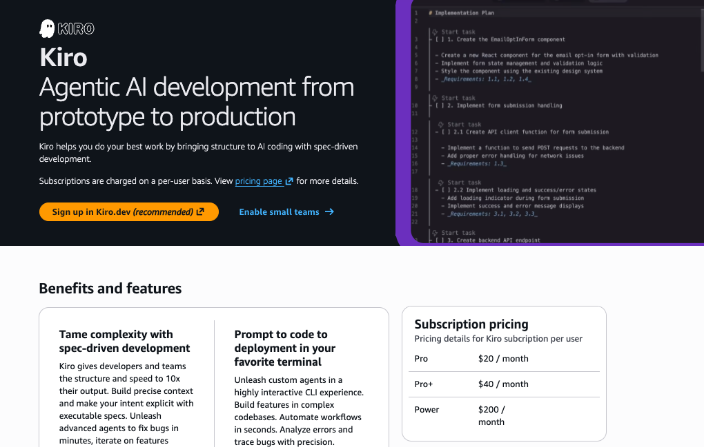
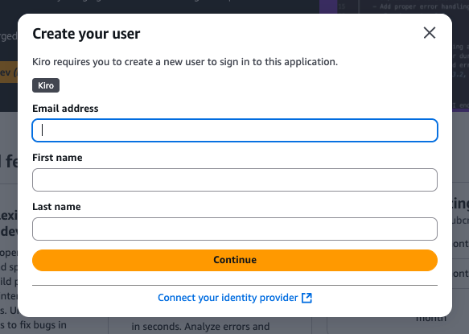
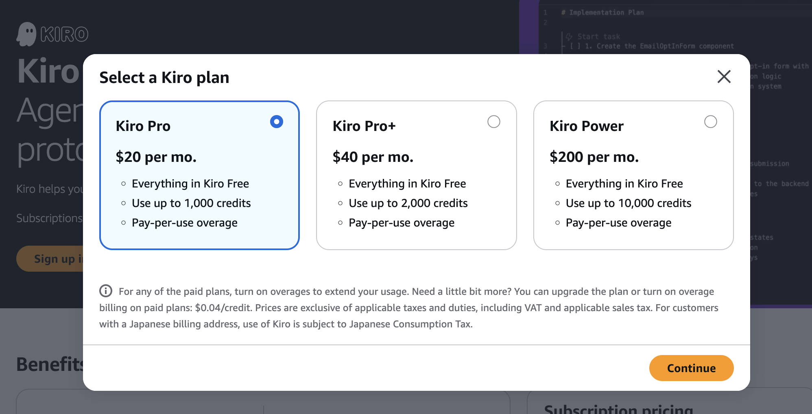
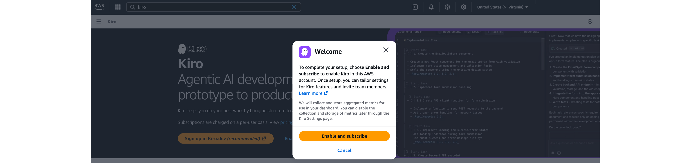

# Kiro 프로파일 설정

## AWS 콘솔에서 Kiro 프로파일 만들기

N.Virginia 의 AWS 관리 콘솔에서 Kiro 콘솔로 이동하여 **Kiro 프로파일** 을 생성하고, 조직 사용자와 Kiro 구독 플랜을 연결할 수 있습니다.

1. AWS 콘솔에서 [Kiro 콘솔](https://us-east-1.console.aws.amazon.com/amazonq/developer/home)로 이동합니다.

2. **Enable small teams**를 클릭합니다. 이 기능을 계속 진행하면 Kiro 사용자 한 명을 신규등록하고 구독 플랜을 맵핑할 수 있습니다. 

- 이메일 주소 (E-mail 주소를 정확하게 기입하여 후속 절차에 지장이 없도록 유의해주세요.)
- 이름
- 성

3. 사용자 정보를 입력하고 **계속**을 클릭합니다.

이제 Amazon Q Developer 프로파일의 프로파일 이름을 설정하라는 메시지가 표시됩니다. 프로파일을 사용하면 ID 공급자의 모든 사용자 또는 일부 사용자에 대한 사용자 지정 및 제어 설정을 만들 수 있습니다.

4. 이 유저에게 할당할 Kiro 구독 플랜을 선택할 수 있습니다. **Kiro Pro** 를 선택합니다. **Continue** 를 선택합니다.

5. **Enable and Subscribe** 를 클릭하고 다음 챕터로 이동합니다.

## 다음 단계

Kiro 프로파일과 함께 신규 유저 하나가 생성되었습니다. 다음 챕터에서는 AWS IAM Identity Center 에서 조직의 MFA 설정을 변경하고, 방금 등록한 유저의 조직 가입을 확정하겠습니다.
