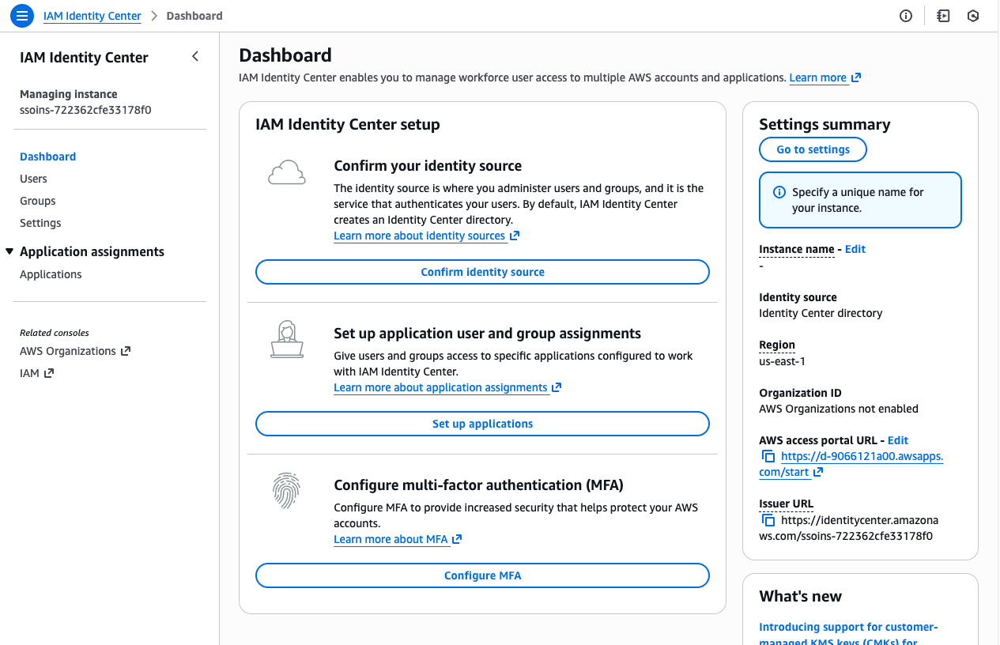
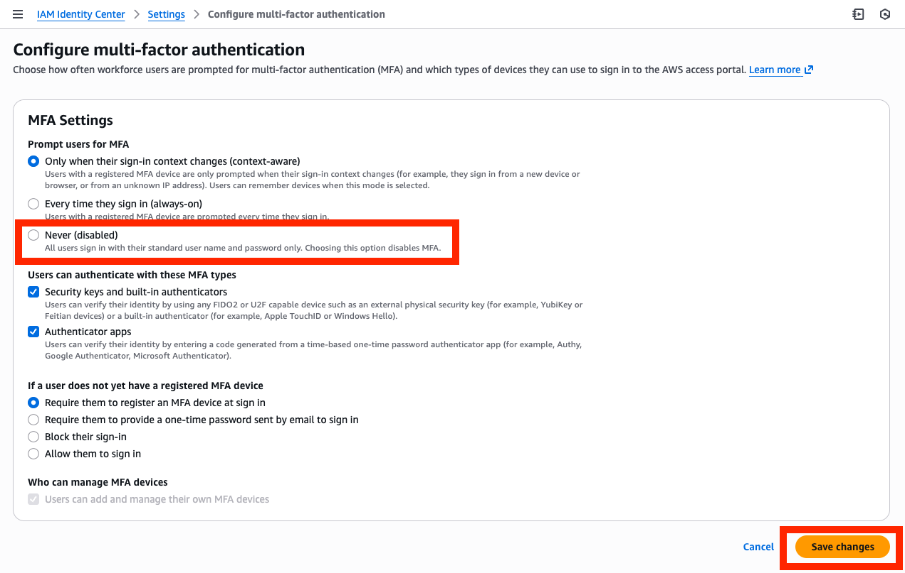
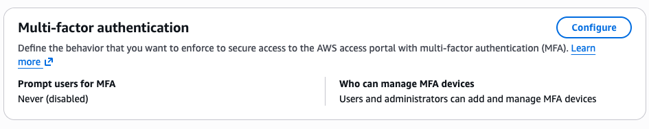

# 다중인증(MFA) 설정

## 다중인증(MFA) 설정하기

1. N.Virginia 의 [AWS IAM Identity Center 콘솔](https://us-east-1.console.aws.amazon.com/singlesignon/home)로 이동합니다. Kiro 프로파일을 만들때 같이 설정된 여러분의 조직 인스턴스를 확인할 수 있습니다.

2. **Configure MFA**를 클릭합니다.

이 화면에서 AWS access portal 에 접근할 때 강제할 다중인증(MFA) 정책을 지정할 수 있습니다.

3. 이번 실습에서는 MFA 인증 절차를 생략할 것입니다. **Prompt users for MFA** 속성에서 **Never**를 선택하고 저장하세요.

> [!NOTE]
> 프로덕션 환경에서는 향상된 보안을 위해 IAM Identity Center 조직 인스턴스에서 다중인증 정책을 구성하는 것이 바람직합니다.
