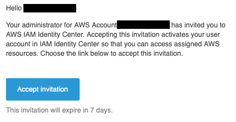
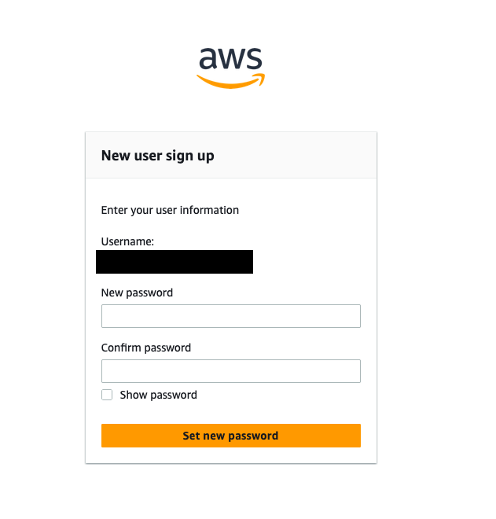
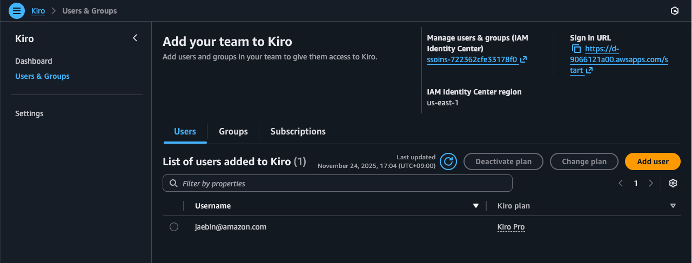
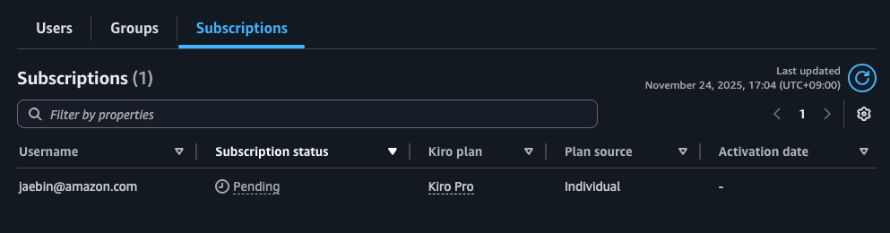

# Kiro 구독 확인

## 유저 이메일 인증

1. 여러분이 사용자로 등록한 이메일로 최종적인 온보딩 절차가 전송됩니다. 이메일의 **초대 수락** 버튼을 클릭하여 제공된 링크를 엽니다.

> [!NOTE]
> **주요 정보**
>
> 초대 메일에는 Kiro IDE 조직 사용자로 로그인할 때 필요한 정보가 제공되고 있습니다. 다음 항목을 메모해 두세요.
> - Your AWS access portal URL

2. 새 사용자의 비밀번호를 설정하는 페이지로 리디렉션됩니다. 여기새 **새 비밀번호를 설정** 합니다.

3. 여러분은 AWS access portal 로 이동하게 됩니다. 이 유저가 Kiro 서비스에 접근하도록 허가하는 절차입니다.

초기 설정을 완료했다면 정상적으로 Kiro 구독이 생성되었는지 확인할 수 있습니다.

4. [Kiro 콘솔](https://us-east-1.console.aws.amazon.com/amazonq/developer/home)로 되돌아갑니다. 좌측 메뉴에서 **Users & Groups** 항목에 들어가고 **Users** 탭을 확인하세요.

현재 Kiro Pro 플랜에 등록된 사용자 한 명이 확인됩니다. 여러분이 제공한 정보와 일치하는지 확인해 주세요.

> [!NOTE]
> **구독 활성 시점**
>
> **대기중** 상태의 Kiro 구독은 첫 사용이 발생한 후 **활성** 상태로 변경됩니다.
