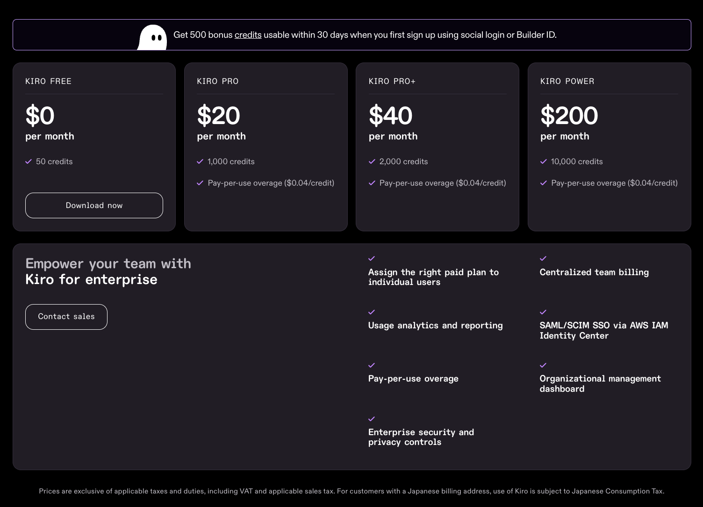

# Kiro 구독 플랜

## Kiro 구독 플랜

사용자는 Kiro IDE 에서 필요한 요청 크레딧 및 추가 기능에 따라 4가지 구독 플랜을 선택합니다. **크레딧**(Credit)은 요청에 따라 부분적으로 소모됩니다. 간단하고 짧은 작업은 복잡하고 긴 작업보다 적은 크레딧을 사용합니다. 

1. **Kiro Free**: 50 크레딧, No overage
2. **Kiro Pro**: 1,000 크레딧, Overage 가능
3. **Kiro Pro+**: 2,000 크레딧, Overage 가능
4. **Kiro Power**: 10,000 크레딧, Overage 가능

**무료 트라이얼**

Kiro 를 처음 시작하는 모든 유저는 30일간 무료 트라이얼 상태에 진입합니다. 무료 트라이얼은 한 달간 500 크레딧을 제공하며 크레딧 소진 또는 기간이 경과된 후 유료 구독제로 이동하거나, 무기한으로 Kiro Free 플랜을 유지할 수 있습니다.

## 개인 사용자를 위한 빌링

> [!NOTE]
> AWS Builder ID 계정의 경우, 현재는 AWS 계정과 연결되지 않은 상태에서만 업그레이드가 가능합니다.

개인 개발자로서 Kiro를 사용할 예정이라면, 소셜 로그인(Google, GitHub 등) 또는 AWS Builder ID를 통해 간편하게 구독을 시작하고 관리할 수 있습니다. 

## 조직을 위한 엔터프라이즈 빌링

> [!NOTE]
> 이 실습 컨텐츠는 엔터프라이즈 빌링 방식으로 사용자를 온보딩할 것입니다.

여러분이 팀 단위로 Kiro IDE 구독을 관리하고 싶은 조직 관리자라면, **AWS IAM Identity Center** 와 연결하여 조직 사용자 별 Kiro 구독 현황을 관리하고 AWS 계정 빌링을 통해 플랜 요금을 지불할 수 있습니다. 

Kiro 구독을 관리하기 위한 AWS 콘솔은 하위 2개 리전에서 지원하고 있습니다.

- `us-east-1` (N. Virginia)
- `eu-central-1` (Frankfurt)

## 다음 단계
하위 챕터로 이동하여 AWS 계정에 Kiro Profile 을 생성하고, AWS IAM Identity Center 사용자를 등록하며, Kiro 플랜에 구독하는 과정을 진행하세요.
