# 1) 인스턴스 접속하기 (RDP)

## 1. RDP Client 준비

Kiro IDE 와 Spirit of Kiro 소스코드가 설치된 EC2 환경에 원격 접속하겠습니다. 여러분의 로컬 환경에 설치된 RDP 클라이언트를 사용하여야 합니다.

운영체제에 따라 사용할 RDP 클라이언트 및 원격 접속 가이드를 확인하시기 바랍니다.

- Windows: [원격 데스크톱 연결](https://learn.microsoft.com/ko-kr/windows-server/remote/remote-desktop-services/remotepc/remote-desktop-allow-access?source=recommendations)
- macOS: [Windows App](https://apps.apple.com/us/app/windows-app/id1295203466?mt=12)

## 2. 워크샵 대시보드 확인

[**이벤트 대시보드 열기**](https://catalog.prod.workshops.aws/event/dashboard/ko-KR)

접속할 인스턴스 IP 주소와 사용자 정보를 확인하기 위해 워크샵 대시보드로 이동합니다. 하단 테이블에서 접속 정보를 확인 및 복사할 수 있습니다.

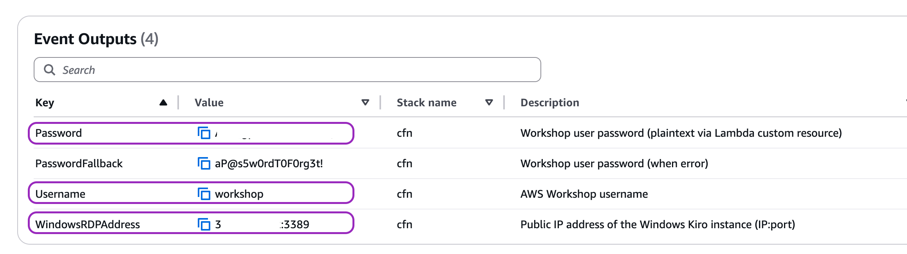

- **WindowsRDPAddress**: 인스턴스 RDP 접속 주소
- **Username**: 로그인할 사용자 (workshop)
- **Password**: 로그인 비밀번호

## 3. RDP 접속

### MacOS 에서 시작하기

RDP 클라이언트 프로그램에서 접속 정보를 기입하여 EC2 인스턴스에 원격 접속합니다.

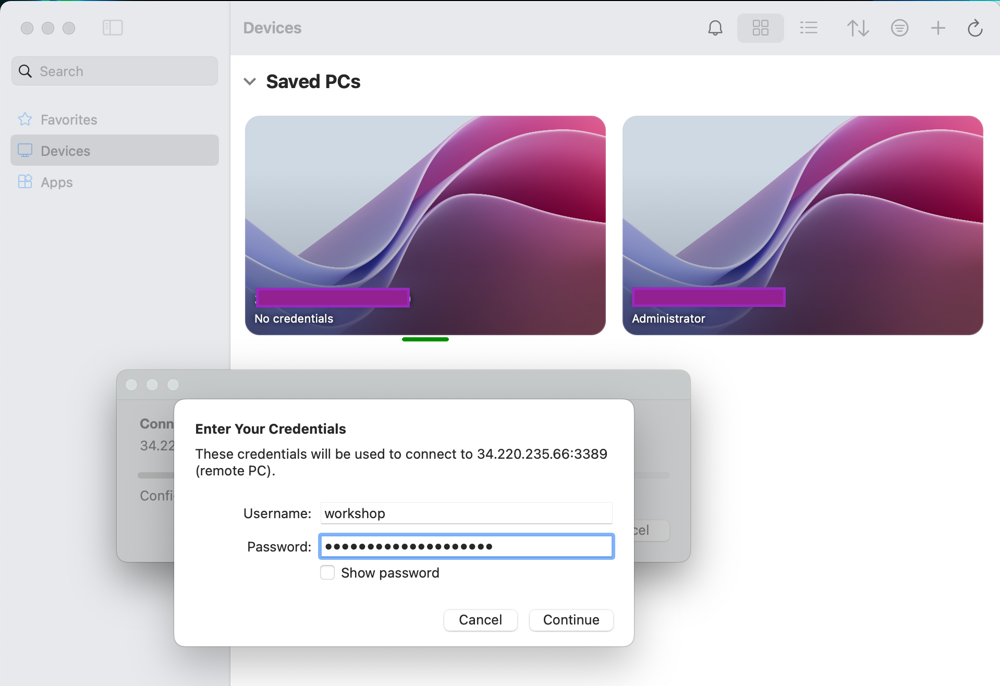

### Windows 에서 시작하기

원격 데스크톱 연결(Remote Desktop) 응용 프로그램을 실행합니다. 접속 유저명이 `workshop` 이 되도록 반드시 구성을 수정합니다.

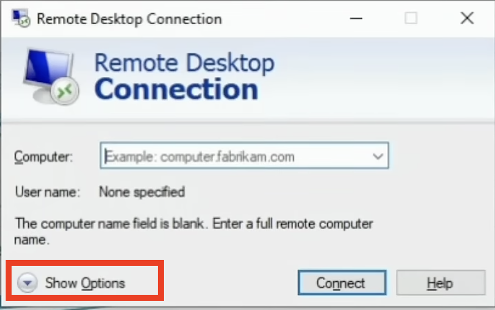
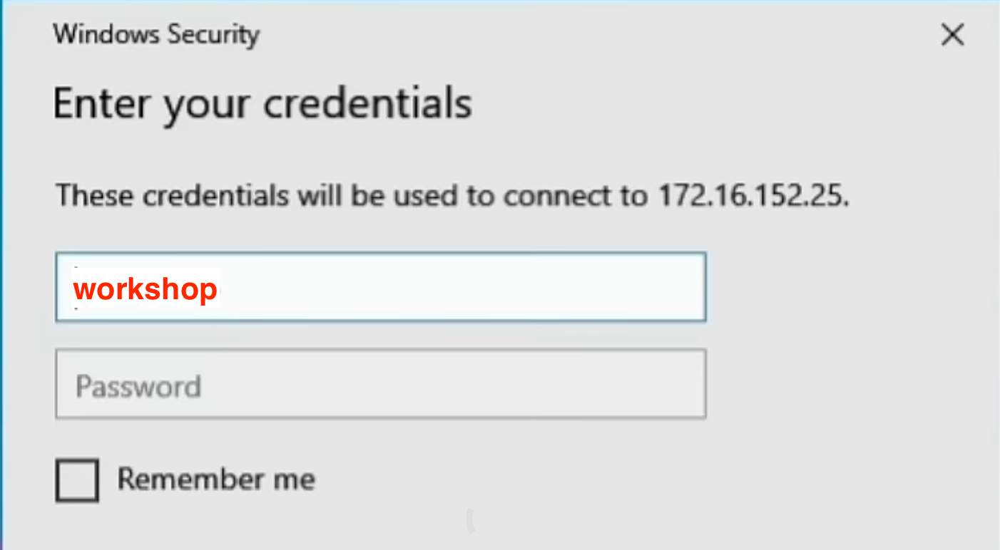

### 접속 결과

이 인스턴스는 Windows 서버 운영체제로 제공됩니다. 바탕화면에는 Kiro IDE 와 워크샵 소스코드로 이동할 수 있는 바로가기 아이콘이 생성되어 있습니다.

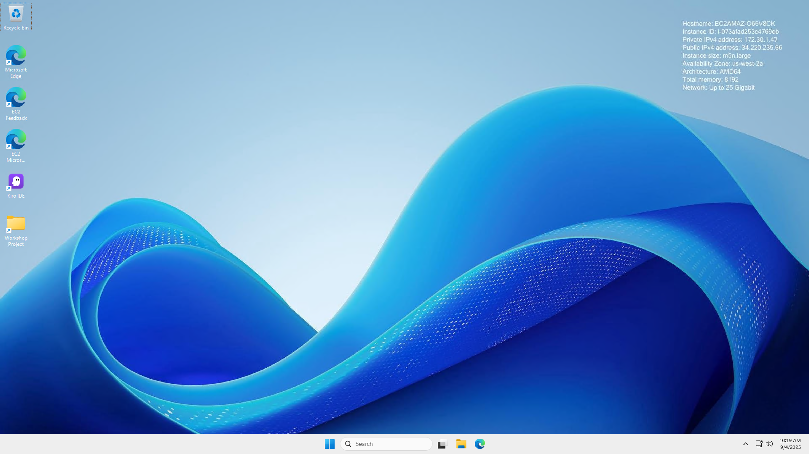

> [!NOTE]
> **아이콘 생성 시기**
>
> 여러분이 윈도우 사용자로 로그인한 후 수초 뒤 바로가기 아이콘을 만드는 Powershell 스크립트가 실행됩니다.
>
> 아이콘이 나타나지 않는 경우:
> - 현재 인스턴스 환경이 셋업중입니다. Powershell 스크립트 동작까지 잠시 더 대기합니다.
> - 또는, `C:\ProgramData` 위치로 이동하여 직접 리소스에 액세스합니다.
>   - `Kiro\Kiro.exe`: Kiro IDE 실행 파일
>   - `KiroWorkshop\challenge`: 프로젝트 코드베이스

## 4. Kiro IDE 실행과 로그인

바탕화면 아이콘으로 Kiro IDE 를 열어 보겠습니다.

본 실습에서는 권한 충돌로 인한 실습 장애를 방지하기 위해 애플리케이션을 **관리자 권한으로 실행**(Run as Administrator)할 것을 권장합니다.

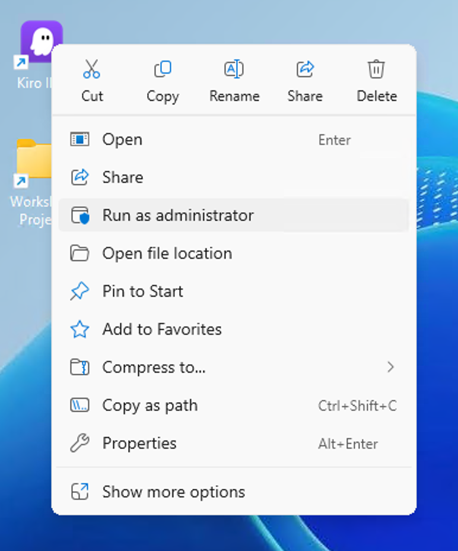

1. 그림과 같이 Kiro IDE 아이콘을 **우클릭**합니다.
2. **Run as Administrator** 메뉴를 선택합니다.
3. Kiro IDE 로그인 화면이 등장하는지 확인합니다.

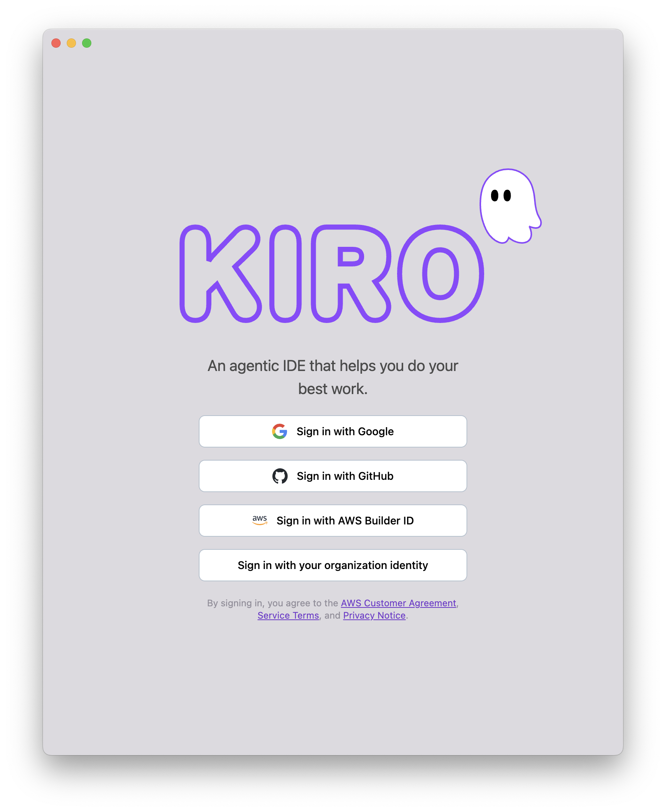

4. 워크샵 이벤트 진행자가 안내하는 방법으로 **IDE 에 로그인**하십시오.

인증 방법들

Kiro는 AWS 계정 없이도 독립적으로 작동하는 AI IDE입니다. 애플리케이션을 다운로드하여 즉시 사용할 수 있으며, AI 상호작용과 코드 지원 기능을 애플리케이션 자체에서 직접 처리합니다. 다른 AWS 서비스를 사용하든 그렇지 않든, Kiro의 모든 기능을 활용하여 개발 워크플로우를 향상시킬 수 있습니다.

Kiro는 다음과 같은 인증 제공업체를 지원합니다.

- **GitHub**: GitHub 계정과의 원활한 통합
- **Google**: Google 자격 증명으로 로그인
- **AWS Builder ID**: 개별 개발자를 위한 빠른 설정
- **AWS IAM Identity Center**: Amazon Q Dev Pro 구독을 통한 엔터프라이즈급 인증

---

### GitHub으로 로그인

다음 지침에 따라 GitHub을 사용하여 Kiro에 로그인하세요.

**GitHub으로 로그인하려면:**

1. Kiro에서 **Sign in with GitHub**을 선택합니다. 로그인 프로세스를 완료하기 위해 기본 웹 브라우저로 리디렉션됩니다.
2. 사용자 이름 또는 이메일 주소와 비밀번호를 입력한 후 **Sign in**을 선택합니다.
3. **Authorize kirodotdev**를 선택하여 GitHub 계정으로 Kiro 앱을 승인합니다.

---

### Google로 로그인

다음 지침에 따라 Google을 사용하여 Kiro에 로그인하세요.

**Google로 로그인하려면:**

1. Kiro에서 **Sign in with Google**을 선택합니다. 로그인 프로세스를 완료하기 위해 기본 웹 브라우저로 리디렉션됩니다.
2. Kiro와 함께 사용할 Google 계정을 선택합니다.
3. **Continue**를 선택하여 Google 계정으로 Kiro 앱을 승인합니다.

---

### AWS Builder ID로 로그인

다음 지침에 따라 AWS Builder ID를 사용하여 Kiro에 로그인하세요.

**AWS Builder ID로 로그인하려면:**

1. Kiro에서 **Login with AWS Builder ID**를 선택합니다. 로그인 프로세스를 완료하기 위해 기본 웹 브라우저로 리디렉션됩니다.
2. 이메일 주소를 입력한 후 **Next**를 선택합니다.
3. 비밀번호를 입력한 후 **Sign in**을 선택합니다.
4. **Allow access**를 선택하여 Kiro 앱을 승인합니다.

---

### AWS IAM Identity Center로 로그인

다음 지침에 따라 AWS IAM Identity Center를 사용하여 Kiro에 로그인하세요.

**AWS IAM Identity Center로 로그인하려면:**

1. Kiro에서 **Sign in with AWS IAM Identity Center**를 선택합니다.
2. Kiro 플랜 구독 단계에서 수신한 E-mail 에는  `Your AWS access portal URL` 값이 제공됩니다. **Start URL**에 해당 주소를 기입합니다.
3. **Region**에 ID 디렉터리를 호스팅하는 AWS 리전을 입력한 후 **Continue**를 선택합니다.

## 5. 코드베이스 열기

Spirit of Kiro 프로젝트 소스코드를 엽니다.

1. 로그인 완료 후 Kiro IDE 화면에서 "Open a project" 버튼을 선택하세요.

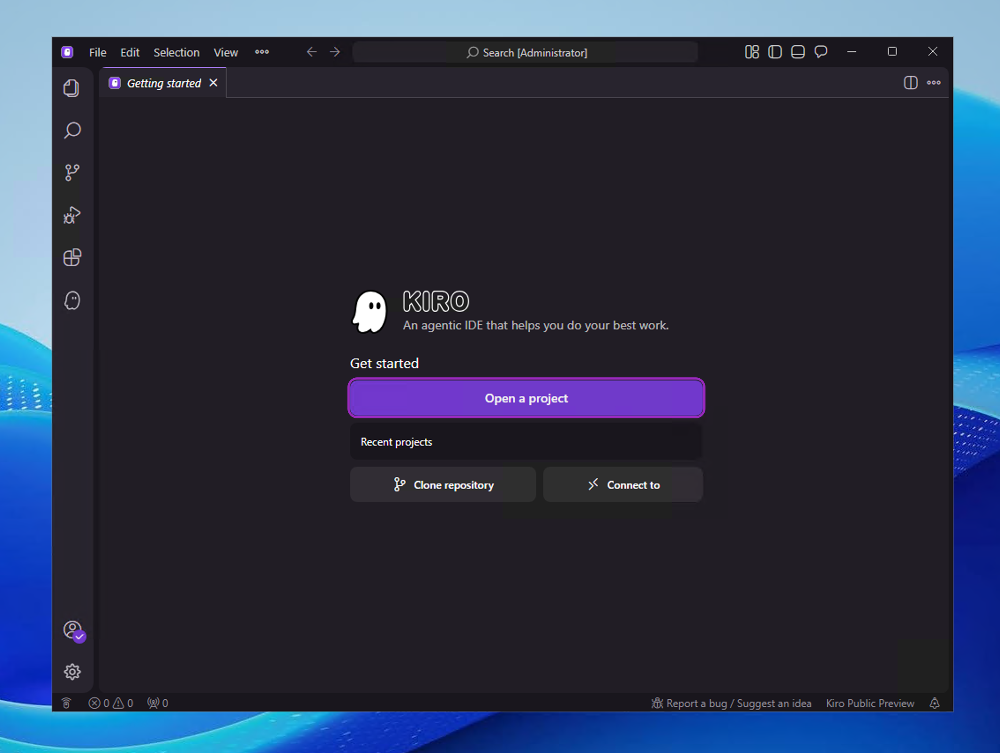

2. Desktop 의 Workshop Project 바로가기를 선택하세요.

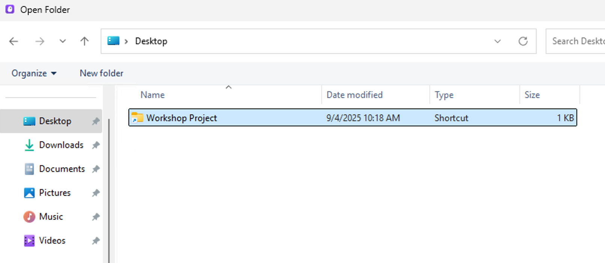

3. 터미널을 열기 위해 IDE 상단 메뉴> Terminal> New Terminal 을 선택합니다.

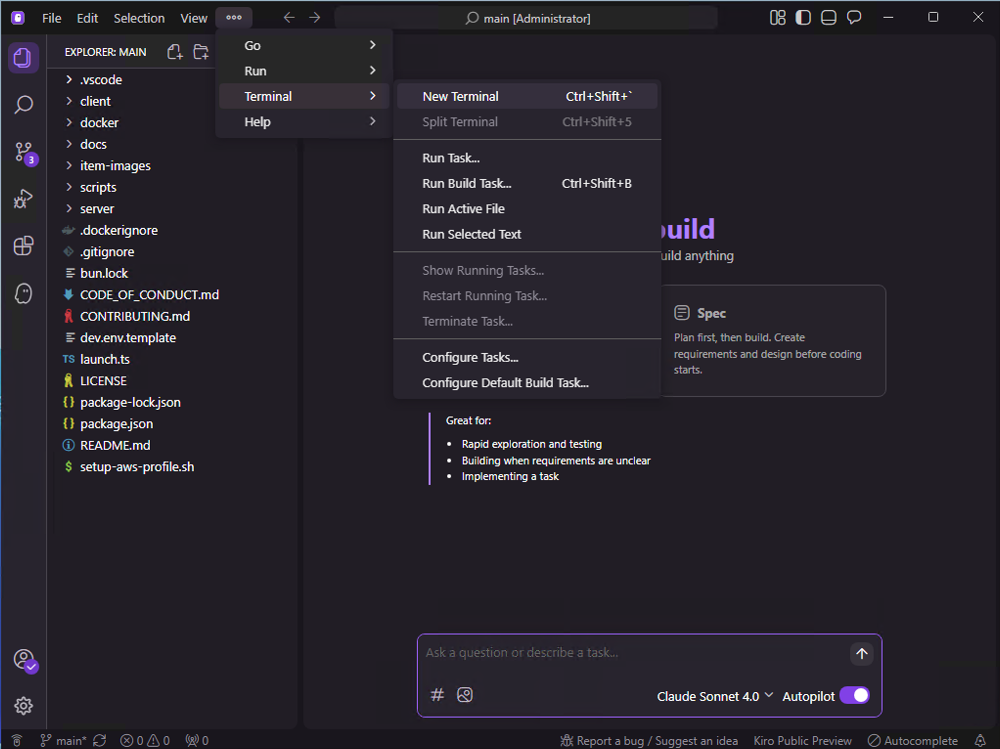

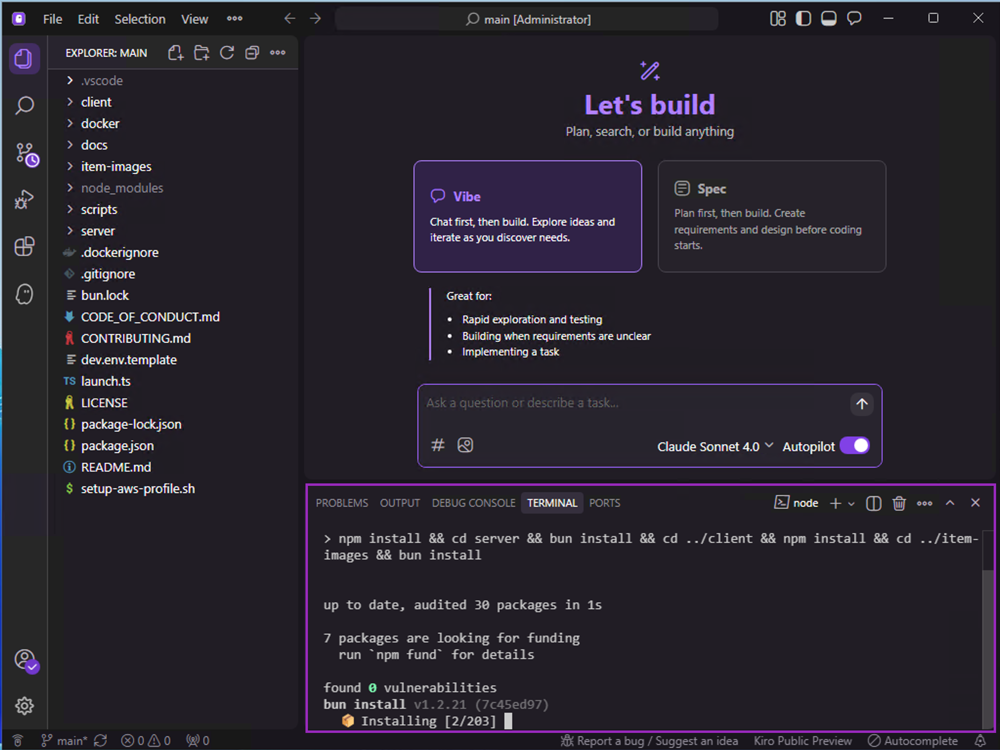

> [!NOTE]
> **터미널 사용 가이드**
>
> 앞으로 실습에서 터미널 명령 실행이 필요할 경우, 본 가이드에서 진행한 'Kiro IDE 에서 오픈한 Powershell 터미널'을 기준으로 설명합니다.

---

## **다음 단계**

성공적으로 원격 실습 환경에 접속하였다면 게임을 실행하고 IDE 실습을 진행하기 위해 다음 단계로 나아가세요!
