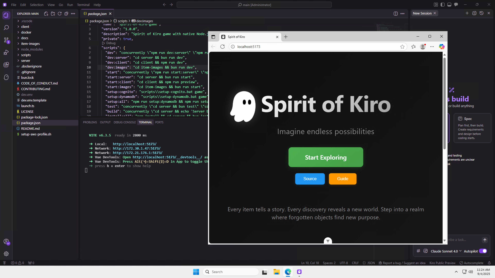

# 2) 게임 실행하기

> [!NOTE]
> **터미널 사용 가이드**
>
> 터미널 명령 실행이 필요할 경우, '관리자 권한의 Kiro IDE 에서 오픈한 Powershell 터미널'이 기준 환경입니다.


원격 환경에서 **Spirit of Kiro** 게임을 실행합니다.


## 1. 의존성 설치 단계

Kiro IDE 에서 오픈한 터미널에서 명령을 실행합니다. Node 패키지 관리 도구중 하나인 [bun](https://bun.com/docs)을 구성하세요.

```bash
irm bun.sh/install.ps1 | iex
```

## 2. 게임 서버 실행

새로운 터미널을 열어서, 아래와 같은 명령어를 실행합니다.

```bash
$env:Path = [System.Environment]::GetEnvironmentVariable("Path","Machine") + ";" + [System.Environment]::GetEnvironmentVariable("Path","User")

npm run dev:server
```

서버가 정상 실행되면 나타나는 메시지입니다. 게임 서버는 8080 포트를 리슨하고 있습니다.

```
✅ Server initialization complete
✅ Started development server: http://localhost:8080
```

## 3. 게임 클라이언트 실행

**새로 오픈한 터미널**에서 명령을 실행합니다.

```bash
npm run dev:client
```

클라이언트가 정상 실행되면 다음과 같이 유사한 메시지가 나타나야합니다.

```
  VITE v6.3.5  ready in 2800 ms

  ➜  Local:   http://localhost:5173/
  ➜  Network: http://172.30.1.47:5173/
  ➜  Network: http://172.21.176.1:5173/
  ➜  Vue DevTools: Open http://localhost:5173/__devtools__/ as a separate window
  ➜  Vue DevTools: Press Alt(⌥)+Shift(⇧)+D in App to toggle the Vue DevTools
  ➜  press h + enter to show help
```



## 다음 단계

지금까지 원격 인스턴스에 마련된 Kiro IDE 를 처음 사용해 볼 수 있었습니다. 그리고 Spirit of Kiro 코드베이스를 열어 게임 서버/클라이언트를 실행할 수 있었습니다.

게임 플레이를 위해 클라이언트 주소: http://localhost:5173 에 접근하여 다음 단계로 이어가실 수 있습니다.
