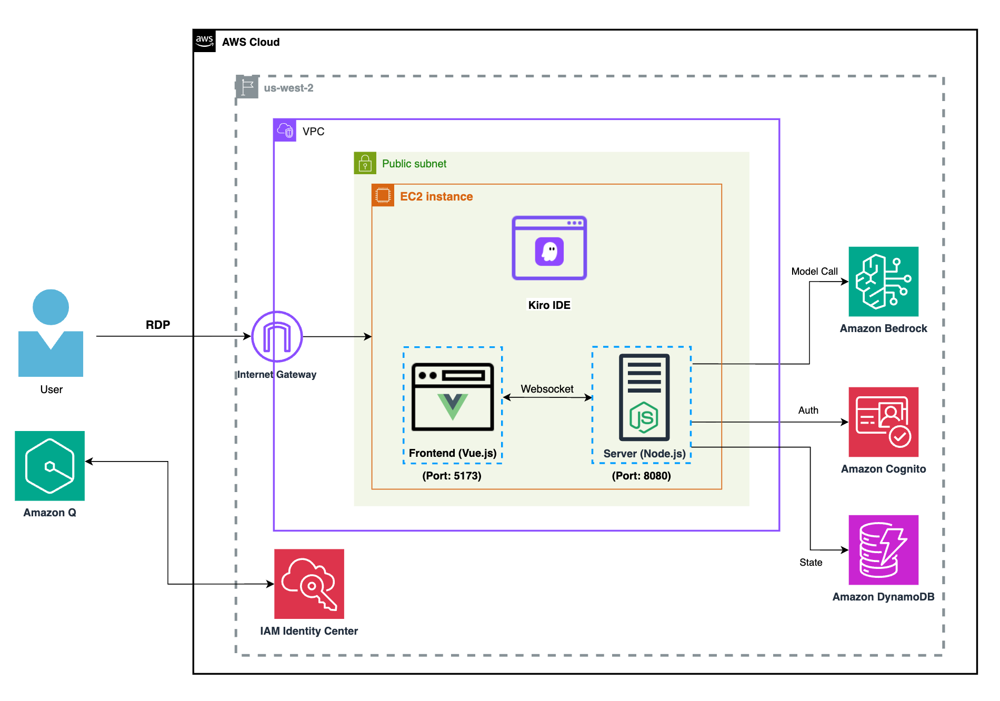

# 실습 방법1: 워크샵 이벤트 환경

> [!NOTE]
> **개요**
>
> 워크샵 이벤트 참여자는 CloudFormation 스택으로 구성된 Spirit of Kiro 실습 환경을 즉시 제공받을 수 있습니다.
> 진행자 안내에 따라 워크샵 이벤트 계정에 미리 접속하십시오.

## **아키텍처**

AWS EC2 인스턴스에서 NodeJS 에 기반하는 게임 프론트엔드, 서버를 실행합니다. 게임 진행 상태와, 플레이어의 인증 정보를 관리할 목적으로 [Amazon DynamoDB](https://aws.amazon.com/dynamodb/) 및 [Amazon Cognito User Pool](https://aws.amazon.com/pm/cognito/) 이 활용됩니다. AI 모델 호출을 위해 Amazon Bedrock 서비스를 사용합니다. 

여러분은 EC2 인스턴스에 마련된 Kiro IDE 를 조작하며 AI IDE 를 활용하는 개발 경험이 가능합니다.

---

- [1) 인스턴스 접속하기 (RDP)](01-rdp-instance/README.md)
- [2) 게임 실행하기](02-game-exec/README.md)
