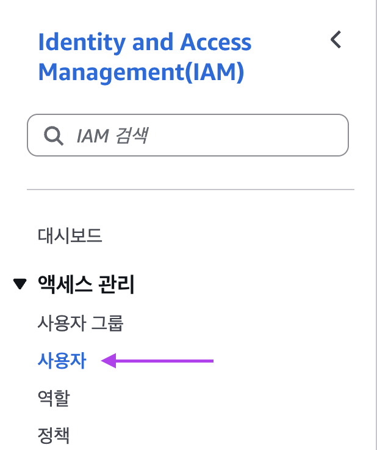
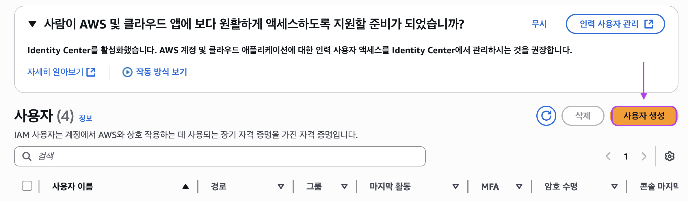
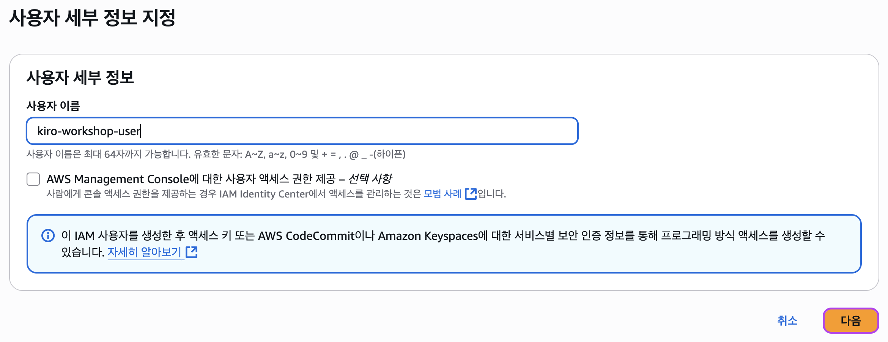
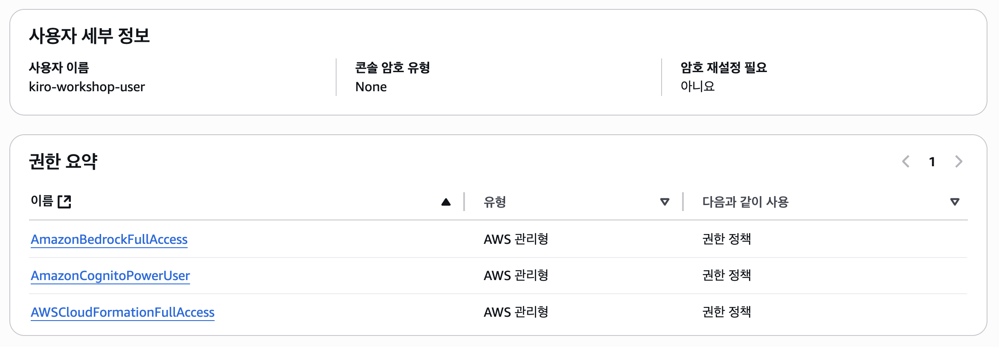
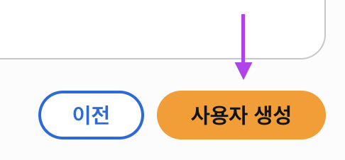
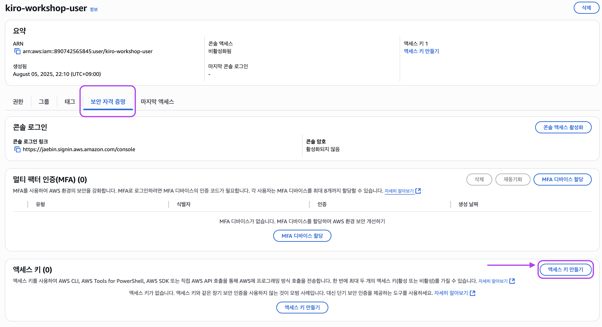
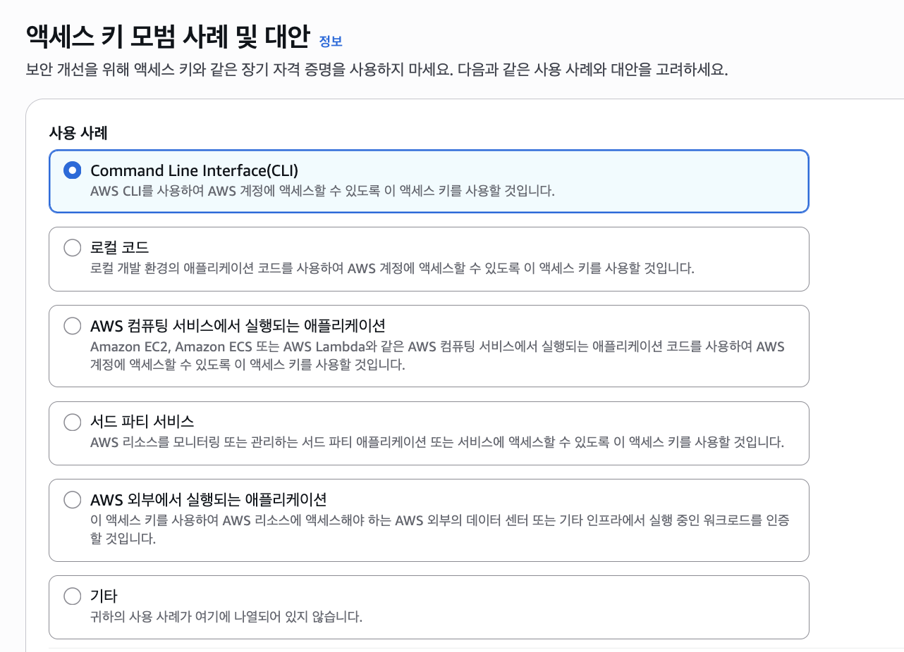
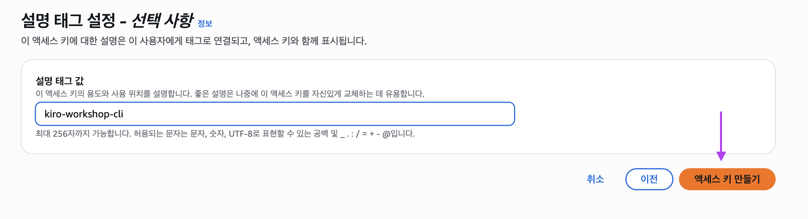
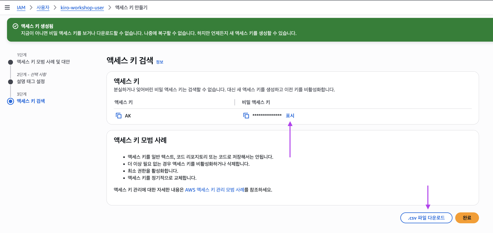

### **1. 필수 도구 설치**

다음 도구들이 로컬 환경에 설치되어 있어야 합니다.

- [**Docker Desktop**](https://docs.docker.com/desktop/) 또는 [**Podman**](https://podman.io/) 그리고 Compose 도구를 설치합니다.
- [**Git**](https://git-scm.com/downloads) (Windows 사용자의 경우 **Git bash** 포함)
- [**AWS CLI**](https://docs.aws.amazon.com/cli/latest/userguide/getting-started-install.html)

### **2. AWS 계정 및 권한 설정**

#### **2-1. AWS 계정 준비**

1. [AWS 계정 생성](https://aws.amazon.com/ko/free/)이 완료되어 있어야 합니다
2. 루트 계정 또는 관리자 권한을 가진 IAM 사용자로 로그인하세요

#### **2-2. IAM 사용자 생성 및 권한 설정**

워크샵 실습 과정과 게임 기능중 일부는 AWS 계정 내 서비스를 호출하게 됩니다.

따라서 서비스에 호출 권한을 갖추고 있는 IAM 크레덴셜을 발급하여 여러분의 환경에 설정하도록 하겠습니다.

**단계 1: IAM 콘솔 접속, 메뉴 이동**
1. [AWS IAM 콘솔](https://console.aws.amazon.com/iam/)에 접속합니다.
2. 좌측 메뉴에서 **사용자** 클릭
3. **사용자 생성** 버튼 클릭




**단계 2: 사용자 세부 정보 설정**
1. 사용자 이름: `kiro-workshop-user` (또는 원하는 이름)
2. **다음** 클릭



**단계 3: 권한 설정**
1. **직접 정책 연결** 선택
2. 다음 관리형 정책들을 검색하여 선택합니다.
   - `AmazonCognitoPowerUser` (Cognito 사용자 풀 관리)
   - `AmazonBedrockFullAccess` (Bedrock 모델 접근)
   - `AWSCloudFormationFullAccess` (CloudFormation 스택 배포)

   

3. **다음** 클릭

**단계 4: 사용자 생성 완료**
1. 설정 내용 검토 후 **사용자 생성** 을 클릭하면 IAM 사용자가 생성됩니다.

   

#### **2-3. 액세스 키 생성**

**단계 1: 보안 자격 증명 탭**
1. 생성된 사용자의 **보안 자격 증명** 탭 클릭
2. **액세스 키** 섹션에서 **액세스 키 만들기** 클릭

   

**단계 2: 사용 사례 선택**
1. "Command Line Interface(CLI)" 선택
2. 확인 체크박스 선택 후 **다음** 클릭
3. 설명 태그 입력 (선택사항): `kiro-workshop-cli`
4. **액세스 키 만들기** 클릭
5. **중요**:  생성된 시크릿 액세스 키는 본 화면에서 표시하여 확인할 수 있으나, 크레덴셜 쌍 파일 정보를(.csv) 안전한 곳에 저장합시기 바랍니다.

   
   
   


#### **2-4. AWS CLI 인증 구성**

개인 환경에 AWS CLI 프로파일을 작성합니다. 커맨드라인 환경을 열고 다음 명령을 실행하세요.

```bash
aws configure
```

진행되는 프롬프트에 따라 값들을 입력합니다.
- **AWS Access Key ID**: 위에서 생성한 액세스 키 ID
- **AWS Secret Access Key**: 위에서 생성한 시크릿 액세스 키  
- **Default region name**: `us-west-2` (**중요**)
- **Default output format**: `json`

#### **2-5. 권한 확인**

설정이 완료되었다면 다음 명령들이 응답을 반환하는지 검증해 봅니다.

```bash
# 현재 사용자 정보 확인
aws sts get-caller-identity
```

```bash
# Cognito 권한 확인
aws cognito-idp list-user-pools --max-results 10
```

```bash
# Bedrock 권한 확인 (리전 주의)
aws bedrock list-foundation-models
```
