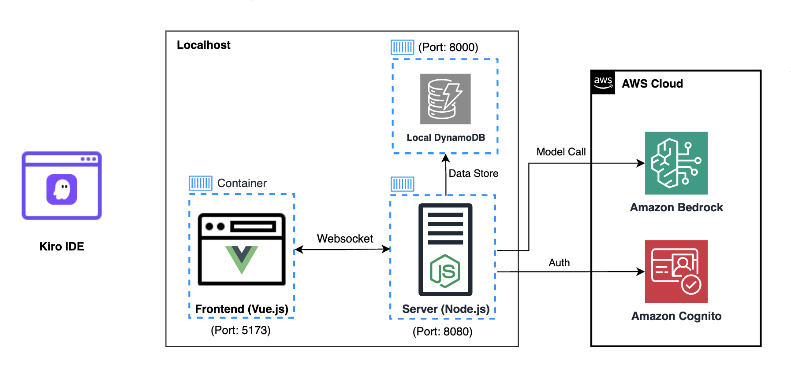

# 실습 방법2: 개인 로컬 환경

> [!NOTE]
> **개요**
>
> 여러분 컴퓨터 환경에 직접 Spirit of Kiro 실습을 위한 사전 설치 과정을 안내합니다.

## **아키텍처**

로컬 환경에서 게임의 프론트엔드, 서버, 로컬 스토리지(DynamoDB Local)를 컨테이너 환경으로 실행합니다. 사용자 인증을 위해 AWS 환경에 Amazon Cognito를 배포하게 됩니다. AI 모델 호출을 위해 Amazon Bedrock 서비스를 이용하는 구조입니다.

## **운영체제 환경**

실습자 환경으로 상정하는 3가지 운영체제는 다음과 같습니다.

- Windows10 이상 운영체제
- MacOS
- Ubuntu 데스크탑

---

## **체크리스트**

| 구분 | 항목 | 비고 |
|------|------|------|
| **로컬 도구** | Docker Desktop 또는 Podman 설치 | 게임의 컨테이너 런타임 |
| **로컬 도구** | Git 설치 | 게임 소스코드 관리 |
| **로컬 도구** | AWS CLI 설치 | AWS 서비스 접근 |
| **AWS 계정** | AWS 계정 | Amazon Bedrock, Amazon Cognito 사용 |
| **AWS 권한** | AWS CLI 프로파일 구성 | `aws configure --profile default` 로 구성 |
| **IAM 유저 권한** | Amazon Cognito 권한 | `cognito:*` 액션 가능|
| **IAM 유저 권한** | Amazon Bedrock 권한 | `bedrock:*` 액션 가능|
| **IAM 유저 권한** | AWS CloudFormation 권한 | `cloudformation:*` 액션 가능 |
| **Bedrock 모델 활성** | 게임 아이템 생성 기능 | Amazon Nova Pro 및 Claude 3.7, 4.0 액세스 | 
| **네트워크** | 게임 서버/클라이언트 포트 | 8080, 5173 포트 사용 가능 |

사전 구성에 필요한 사항을 한 눈에 보기 쉽도록 정리해 두었습니다. 각 항목들을 구성하는 사항에 대해서 아래 가이드를 따라가시기 바랍니다.

---

- [1) 로컬환경 구성](01-local-setup/README.md)
- [2) Kiro IDE 설치와 로그인](02-kiro-setup/README.md)
- [3) 게임 실행하기](03-game-exec/README.md)
