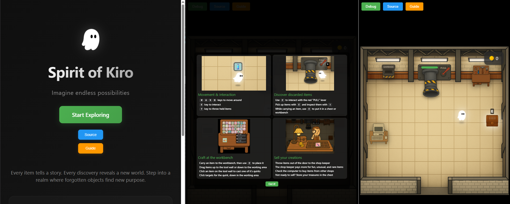

# 게임 플레이 가이드

환경 설정을 완료하고 게임 서버/클라이언트를 잘 실행했다면, 이제 Spirit of Kiro 게임을 플레이 해보세요. 이 가이드는 게임의 기본 조작법과 메커니즘을 설명합니다.

### 게임 접속

'Start Exploring' 클릭 후, 로그인 창에서 회원가입으로 새로운 게임 계정을 만들어 로그인합니다. 

### **기본 조작법**

- **이동**: `W`, `A`, `S`, `D` 키
- **상호작용**: `E` 키
- **아이템 던지기**: `T` 키

### **게임 메커니즘**

#### **1. 아이템 생성**
빨간 레버를 당겨(`PULL`) 무작위 아이템을 생성할 수 있습니다.

#### **2. 아이템 수집**
`E` 키를 사용하여 아이템을 집고 운반할 수 있습니다.

#### **3. 아이템 조합**
작업대에 아이템을 놓고 도구 벽의 도구와 조합하여 새로운 아이템을 만들 수 있습니다.

#### **4. 아이템 판매**
바닥 문으로 아이템을 던져 상점 주인에게 판매할 수 있습니다.

#### **5. 아이템 구매**
컴퓨터에서 다른 플레이어가 만든 아이템을 구매할 수 있습니다.

### **게임 팁**

- **실험 정신**: 다양한 조합을 실험해보세요 - 무한한 가능성이 있습니다
- **정리 정돈**: 작업대가 너무 어수선해지지 않도록 정리하세요
- **보관 활용**: 보관 상자를 활용하여 아이템을 정리하세요
- **품질 중시**: 독특하고 상태가 좋은 아이템일수록 더 높은 가격을 받을 수 있습니다

---

## **다음 단계**

게임 플레이에 익숙해졌다면, 이제 Kiro AI 어시스턴트를 사용하여 게임 코드를 수정하고 새로운 기능을 추가해보세요.
