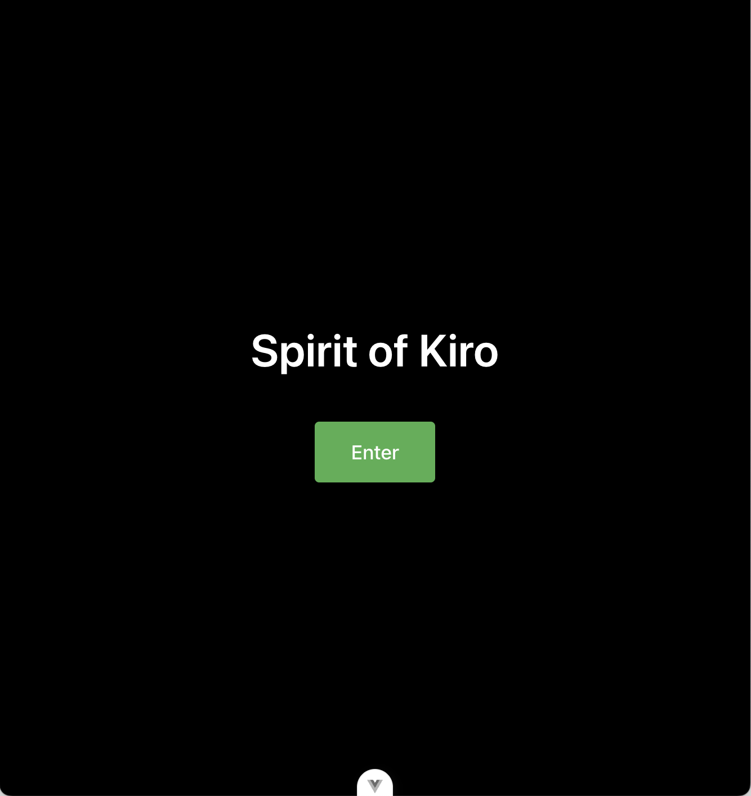
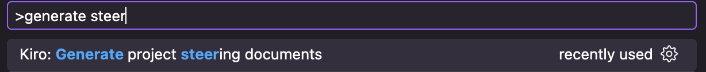
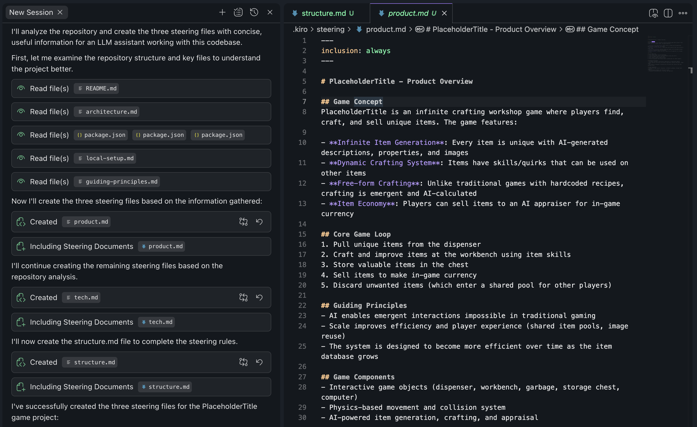
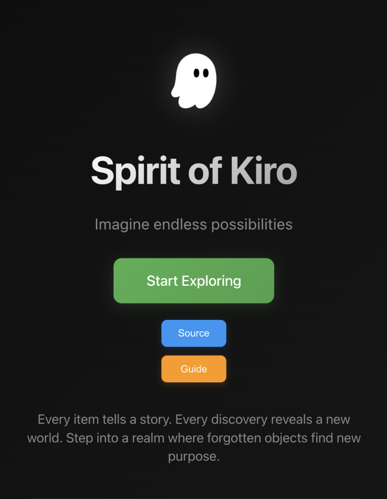
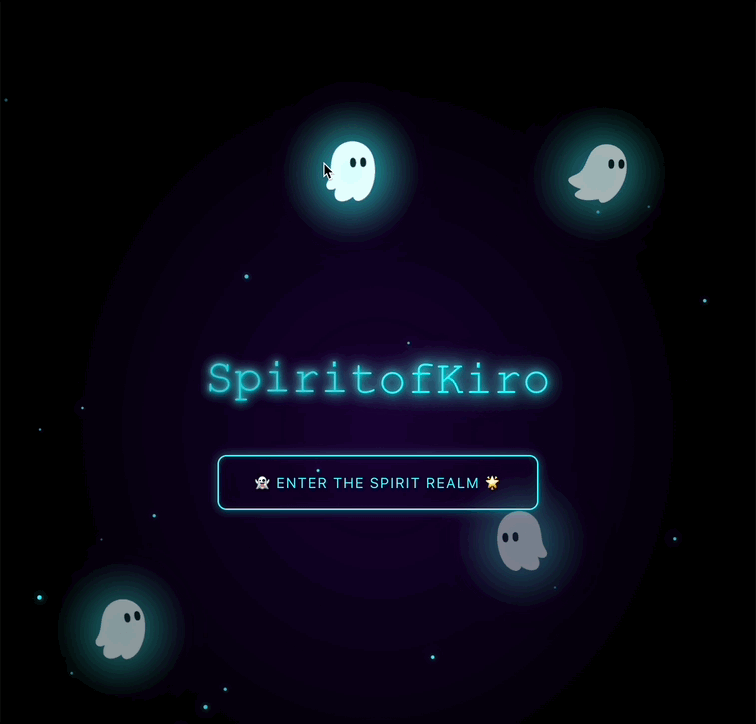

# **Kiro를 활용한 게임 홈페이지 개선**

**전제 조건**: 이 모듈을 시작하기 전에 이전 모듈에서 설명한 대로 게임이 로컬 환경에서 정상적으로 실행되고 있어야 합니다.

---

### **1. 현재 상태 확인하기**



웹 브라우저에서 Spirit of Kiro 웹 사이트를 확인하세요.

현재 홈페이지의 상태:

- 시각적 요소가 부족함
- 게임에 대한 설명이 없음
- 사용자를 위한 안내 정보가 부족함

이러한 상태는 AI를 활용한 빠른 프로토타이핑에 적합한 시작점입니다.

---

### **2. Kiro Steering 파일 설정하기**

코딩을 시작하기 전에 Kiro가 프로젝트를 정확히 이해할 수 있도록 설정해야 합니다.

프로젝트의 복잡성을 고려하여, Kiro에게 프로젝트의 목적, 사용 중인 기술 스택, 프로젝트 구조 등의 정보를 제공하는 것이 중요합니다.

**단계별 설정 방법:**

1. `Ctrl + Shift + P` (Windows/Linux) 또는 `Cmd + Shift + P` (macOS)를 눌러 Command Palette를 엽니다.
2. "Steering"을 검색합니다.
3. `Kiro: Generate project steering documents` 명령을 선택합니다.


> Kiro Steering 설정을 위한 Command Palette 화면. 검색창에 'Steering'이 입력되어 있고, 'Kiro: Setup Steering for Project' 옵션이 강조표시되어 있습니다.

Kiro 에이전트가 저장소의 주요 파일들을 분석하여 프로젝트의 목적, 프로젝트 구조, 기술 스택 정보를 포함한 steering 파일들을 자동으로 생성합니다.

이 파일들은 향후 모든 AI 상호작용에서 더 정확하고 일관된 결과를 제공하는 참조 자료로 활용됩니다.



> Kiro가 생성한 steering 파일들이 표시된 프로젝트 탐색기 화면. .kiro 폴더 내에 product.md, tech.md, structure.md 파일들이 생성되어 있습니다.

생성된 .kiro 폴더를 확인해보세요. 다음과 같은 파일들이 포함되어 있습니다.

- **product.md**: 프로젝트의 목적과 기능을 설명합니다. Kiro가 요청사항을 이해할 때 전체적인 맥락을 파악하는 데 활용됩니다.
- **tech.md**: 프로젝트에서 사용 중인 기술 스택을 문서화합니다. 기존 기술을 유지하면서 일관된 개발 환경을 보장합니다.
- **structure.md**: 프로젝트의 폴더 구조와 주요 구성 요소를 설명합니다. 파일 위치를 빠르게 찾고 올바른 위치에서 작업할 수 있도록 지원합니다.

---

### **3. 기본적인 개선 시작하기**

Steering 파일 설정이 완료되었으므로, 이제 AI를 활용한 개발을 시작할 수 있습니다.

**참고 영상**: Kiro를 활용한 홈페이지 개선 과정
[](https://www.youtube.com/watch?v=kghCcc30H1Q)

**첫 번째 프롬프트 예시:**

```
내 홈페이지를 더 좋게 만들어 줘
```

<details><summary>영어 프롬프트</summary>

```
I want you to make my homepage better.
```

</details>


**실시간 반영 확인:**
게임 클라이언트는 Vite 개발 서버를 통해 제공되므로, Kiro가 수정한 내용이 브라우저에서 즉시 확인 가능합니다.

---

### **4. 창의적인 개선 아이디어 탐색하기**

더 구체적이고 창의적인 요청을 통해 다양한 디자인을 실험해보세요.

**테마 탐색 예시:**

```
내 게임을 더욱 멋지게 만들어줄 20가지 랜딩 페이지 테마를 추천해주렴
```

<details><summary>영어 프롬프트</summary>

```
Give me 20 potential themes for a game landing page. 
```

</details>


**선택한 테마 적용:**

```
그 테마를 기반으로 랜딩 페이지를 다시 만들어줘
```

<details><summary>영어 프롬프트</summary>

```
Reimagine the landing page in that theme.
```

</details>


> [!NOTE]
> **활용 팁**
>
> AI는 창의적인 아이디어 생성에 뛰어납니다. 명확한 계획이 없어도 빠른 디자인 프로토타이핑이 가능합니다. 홈 페이지에 "Apple 제품 마케팅 페이지", "Retro", "Startup"과 같은 다양한 스타일을 적용하거나 "캐러셀", "인용" 또는 "애니메이션"과 같이 페이지에서 원하는 특정 기능을 요청해 보세요.


**디자인 스타일 요청 예시:**

```
- 모던하고 미니멀한 디자인으로 만들어줘
- 게임의 특성을 강조하는 역동적인 디자인으로 해줘
- 사용자 친화적인 인터페이스로 개선해줘
```

**기능 추가 요청 예시:**

```
- 이미지 슬라이더 추가
- 사용자 리뷰 섹션 추가
- 부드러운 스크롤 애니메이션 적용
```

**개선 후 화면 예:**




---

## **학습 목표 달성 확인**

이 모듈을 완료한 후 다음 사항들을 확인해보세요.

1. **Steering 파일 설정 완료**
   - .kiro 폴더가 생성되었는가?
   - product.md, tech.md, structure.md 파일이 존재하는가?

2. **기본 개선 작업 수행**
   - 홈페이지가 시각적으로 개선되었는가?
   - 변경사항이 실시간으로 반영되는 것을 확인했는가?

3. **창의적 실험 완료**
   - 다양한 디자인 스타일을 시도해보았는가?
   - AI의 제안을 바탕으로 페이지를 개선했는가?

## **핵심 개념 요약**

1. **Steering 파일은 AI가 프로젝트를 이해하도록 돕는 핵심 가이드입니다.**
    
    → Kiro와 협업을 시작할 때 가장 먼저 설정해야 할 작업입니다.
    
2. **AI는 매우 창의적이며, 실험의 장벽을 크게 낮춰줍니다.**
    
    → 다양한 프로토타입을 빠르게 시도해보고, 마음에 들지 않으면 간단히 폐기하세요.

**다음 단계**: 다음 모듈에서는 더 복잡한 기능 구현과 코드 최적화를 다룰 예정입니다.
