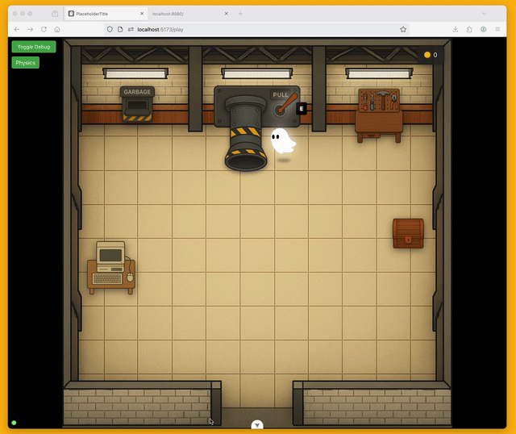

# 엔진의 버그 조사 및 수정

**전제 조건**: 이 모듈을 시작하기 전에 이전 모듈에서 설명한 대로 게임이 로컬 환경에서 정상적으로 실행되고 있어야 합니다.

이전 모듈에서는 게임의 홈페이지를 개선하는 작업을 완료했습니다. 해당 작업은 주로 HTML과 CSS 수준의 작업이었습니다. 이번에는 게임 엔진 코어의 일부인 더 복잡한 JavaScript 코드를 다뤄보겠습니다.

---

### **1. 문제 상황 파악하기**

게임 플레이어들이 물리 엔진의 비정상적인 동작을 보고했습니다. 아이템이 예상보다 과도하게 튀어 오르는 현상이 발생합니다. 

문제는 게임 중 브라우저 탭을 다른 곳으로 전환한 후 다시 게임 탭으로 돌아올 때 발생합니다.

**시각적으로 확인하기:**


> 물리 엔진 버그를 보여주는 애니메이션. 플레이어가 브라우저 탭을 전환한 후 돌아왔을 때 게임 아이템들이 비정상적으로 높이 튀어오르는 모습을 보여줍니다.

---

### **2. AI를 활용한 문제 분석**

다음과 같이 구체적으로 문제를 설명하는 프롬프트를 입력해보세요:

```
무언가가 움직이거나 충돌하고 있는 중에 플레이어가 창을 탭 아웃했다가 다시 돌아오면, 아이템이 엄청나게 튀어 오릅니다. 플레이어들은 "아이템이 난리를 칩니다"라고 말합니다.
```

<details><summary>영어 프롬프트</summary>

```
When something is moving or colliding, and the player tabs out then back in, the items do a tremendous bounce. Players report "items go haywire".
```

</details>


**예상되는 AI 분석 결과:**

Kiro가 프로젝트 파일을 탐색하며 다음과 같은 분석을 제공할 수 있습니다.

> 문제는 physics-system.ts 파일에 있습니다. 사용자가 창을 탭 아웃했다가 다시 돌아올 경우, lastTimestamp 값이 오래된 상태가 되며, 애니메이션 프레임이 다시 시작될 때 deltaTime 계산값이 매우 커집니다 (몇 밀리초가 아닌 몇 초 단위). 이 큰 delta 값이 물리 계산에 그대로 사용되면서, 한 프레임 동안 객체들이 지나치게 멀리 이동하게 되어 비정상적인 동작이 발생합니다.

---

### **3. 추가 해결책 탐색하기**

초기 분석과 기본 수정 코드를 받은 후, 다음과 같이 추가 질문을 해보세요:

```
고려해볼 수 있는 다른 해결책이나 완화 방안이 있을까요?
```

<details><summary>영어 프롬프트</summary>

```
What other potential solutions or mitigations should I consider?
```

</details>


---

### **4. 시스템 전반의 개선점 발견하기**

AI가 특정 문제 영역에 집중한 상태에서, 다음과 같은 확장 질문을 해보세요:

```
개선 가능성이 있어 보이는 다른 부분이 더 있나요?
```

<details><summary>영어 프롬프트</summary>

```
Do you see anything else that looks like it could be improved?
```

</details>


> [!NOTE]
> **활용 팁**
>
> 대규모 언어 모델은 엄청난 너비의 지식을 포함하고 있습니다. 진정한 잠재력을 발휘하려면 인간이 모델을 조금 더 밀어붙여야 합니다. 첫 번째 답변에 대한 프롬프트를 멈추지 마세요. "어째서?", "또 다른 방법은?", "왜 그래야 해?"와 같은 질문을 더하세요.


---

## **핵심 개념 요약**

**AI 엔지니어링의 핵심 원칙:**

  → AI를 단순한 문제 해결 도구로만 여기지 마세요. AI가 가진 지식의 깊이와 폭을 활용해, 자신의 지식의 빈틈을 탐색하는 도구로 사용하세요.

AI를 효과적으로 활용하려면 구체적인 문제 설명, 지속적인 질문, 다각도 접근, 검증과 테스트가 필요합니다. 상황과 증상을 명확히 기술하고, 첫 번째 답변에서 멈추지 말며, 여러 해결책과 개선점을 탐색하고, 제안된 해결책의 효과를 확인해야 합니다.

**다음 단계**: 다음 모듈에서는 더 복잡한 게임 로직과 사용자 경험 개선을 다룰 예정입니다.
