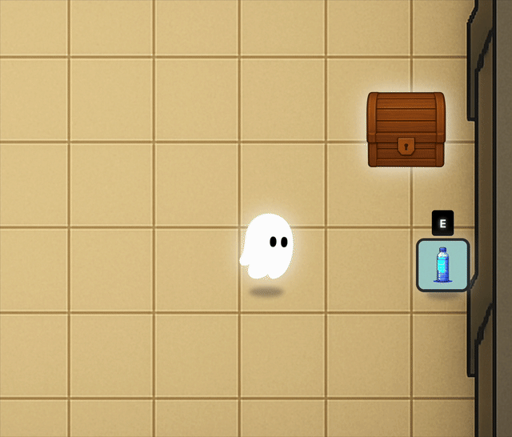
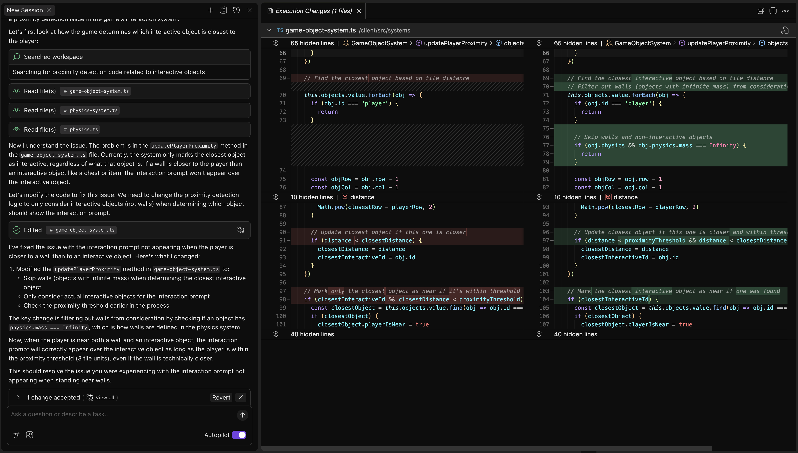
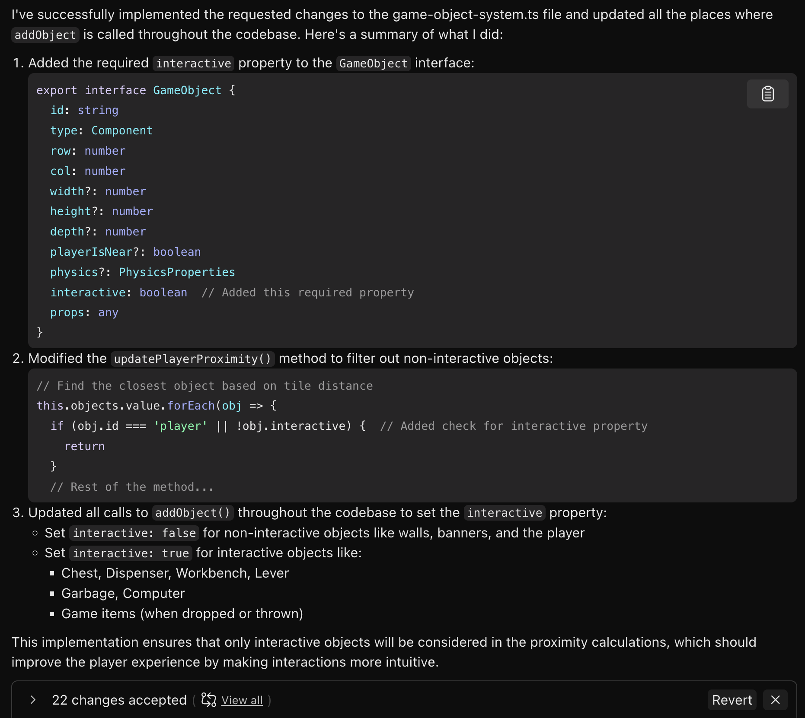

# 여러 파일에 걸쳐 발생한 복잡한 문제 수정

**전제 조건**: 이 모듈은 여러분이 앞서 안내된 설정 지침에 따라 게임을 로컬에서 실행한 상태라고 가정합니다.

- 랜딩 페이지를 개선하기 위한 HTML 및 CSS 작성
- 게임 물리 엔진의 핵심 버그 수정 작업

위 두 작업은 비교적 독립적인 범위 내에서 이뤄졌습니다. 이번에는 여러 파일에 걸쳐 있는 좀 더 복잡한 문제를 해결해 보겠습니다.

---

### 1. 문제 이해하기

게임 플레이어들은 `“E”` 키 상호작용 프롬프트가 기대한 대로 작동하지 않는 경우가 있다고 보고합니다. 특히 벽 근처에 있을 때 이런 문제가 자주 발생합니다.



이 영상에서는 플레이어가 상자나 아이템 근처에 있음에도 불구하고 “E” 프롬프트가 나타나지 않는 것을 확인할 수 있습니다.

Kiro에게 아래와 같은 프롬프트로 문제 해결을 요청해 보세요:

```markdown
플레이어가 상호작용 가능한 객체(예: 아이템이나 상자)보다 벽에 더 가까이 있을 경우, 상호작용 프롬프트가 나타나지 않는 현상이 발생합니다.
```

<details><summary>영어 프롬프트</summary>

```
Sometimes when the player is closer to the wall than to an
interactive object like an item or the chest, then the interact
prompt does not appear over the interactive object.
```

</details>


---

### **2.** AI가 제안한 해결책에 대해 생각해보기

Kiro는 해당 문제를 정확히 파악할 수 있을 것입니다.

플레이어와 가장 가까운 객체를 찾는 함수가 벽을 제외하지 않고 있으며, 이로 인해 플레이어가 벽에 가까이 있을 경우 상호작용할 수 없는 벽이 가장 가까운 객체로 잘못 인식되는 것입니다.



Kiro는 이 문제를 해결하기 위해 **물리 질량이 `Infinity`인 객체를 제외하는 조건**을 추가하는 방식으로 코드를 제안할 수 있습니다.

하지만 이 방식이 정말 최선일까요? 상호작용이 불가능한 객체 중에서도 유한한 질량을 가진 객체가 있을 수 있고, 반대로 무한 질량이지만 상호작용이 가능한 객체도 있을 수 있습니다.

이처럼 질량(`Infinity`)이라는 속성에 논리적으로 무관한 의미를 덧씌우는(overloading) 방식은 단기적으로는 작동하더라도, 장기적으로는 반드시 문제를 야기할 수 있습니다.


> [!NOTE]
> **활용 팁**
>
> AI를 사용할 때는 적극적으로 사고해야 합니다. 처음 제시되는 AI의 해결책을 맹신하지 말고, 더 나은 코드 구조나 설계적 관점에서 접근하는 것이 장기적으로 유지보수에 훨씬 유리합니다.


---

### 3.프로젝트 전반에 걸친 리팩토링

game-object-system.ts 파일 하나만 수정하려 하기보다는, 프로젝트 전체적으로 **구조적인 리팩토링**을 고려해보는 것이 좋습니다.

게임 오브젝트를 생성하는 모든 위치에서, 해당 오브젝트가 **상호작용 가능한지 여부**를 명시하는 것이 바람직합니다.

다음과 같은 프롬프트를 입력해 보세요:

```markdown
"#GameObject"에 interactive라는 새로운 필수 속성을 추가해 주세요.
"#updatePlayerProximity"에서는 상호작용이 불가능한 객체를 필터링해 주세요.
코드 전반의 #addObject 호출부에서 interactive 값을 명시해 주세요 (true 또는 false).
```

<details><summary>영어 프롬프트</summary>

```
In #GameObject add a new required property `interactive`.
In #updatePlayerProximity filter out non interactive objects
All calls to #addObject throughout the code need to set interactive to true or false
```

</details>


> [!NOTE]
> **활용 팁**
>
> Kiro에서 # 기호를 사용하면 Context Picker를 띄워 특정 타입, 클래스, 함수 등을 명시할 수 있습니다. 이렇게 하면 모델이 정확히 어떤 부분을 참조해야 하는지 파악하기 쉬워지며, 훨씬 정밀한 결과를 얻을 수 있습니다


변경 결과는 아래와 같이 여러 파일에 걸쳐 22개 이상의 수정이 이뤄질 수 있습니다.



이러한 리팩토링을 통해, 앞으로 게임 오브젝트의 API가 “이 객체는 상호작용 가능한가?”에 대한 명확한 의미를 내포하게 됩니다.

향후 AI가 기능을 구현할 때에도 이 의미를 활용할 수 있습니다.

---

## **핵심 개념 요약**

이 모듈에서 배운 세 가지 핵심 개념은 다음과 같습니다.

**1. 비판적 사고의 중요성**
AI가 생성한 코드라고 해서 바로 적용하지 마세요. 지금 당장은 잘 작동하더라도, AI는 현재 보이는 문제만 생각합니다. 우리는 한두 단계 더 앞서 생각해야 합니다.

**2. 정확한 컨텍스트 제공**
프롬프트 입력 시 특정 함수/클래스를 명시하세요. # Context Picker를 활용하면 더욱 정확한 코드 생성을 유도할 수 있습니다.

**3. 명확한 API 설계**
이름짓기(naming)는 매우 중요합니다. 코드의 API는 명확한 의미(semantic meaning)를 갖도록 해야 합니다. 서로 관련 없는 기능을 하나의 속성에 억지로 담으면, 결국 유지보수성에서 큰 문제가 발생합니다.

**다음 단계**: 다음 모듈 에서는 바이브 코딩으로 게임 소스코드 전반에서 개선사항을 찾고 수정합니다.
