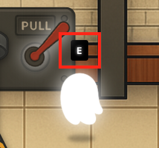
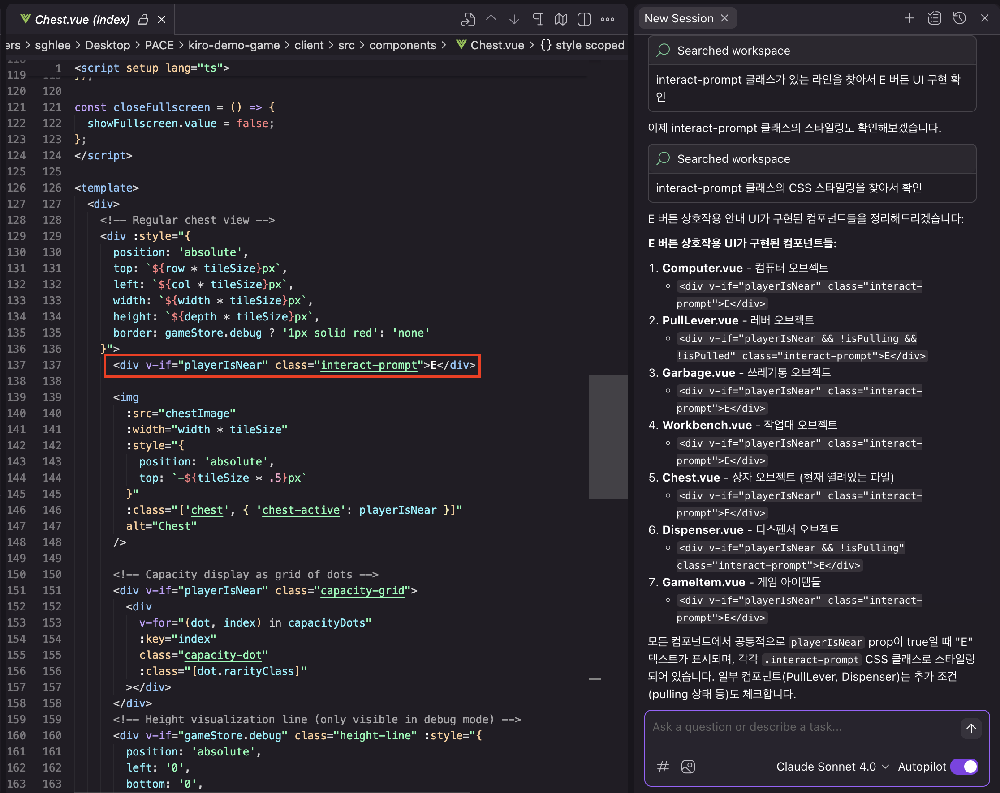
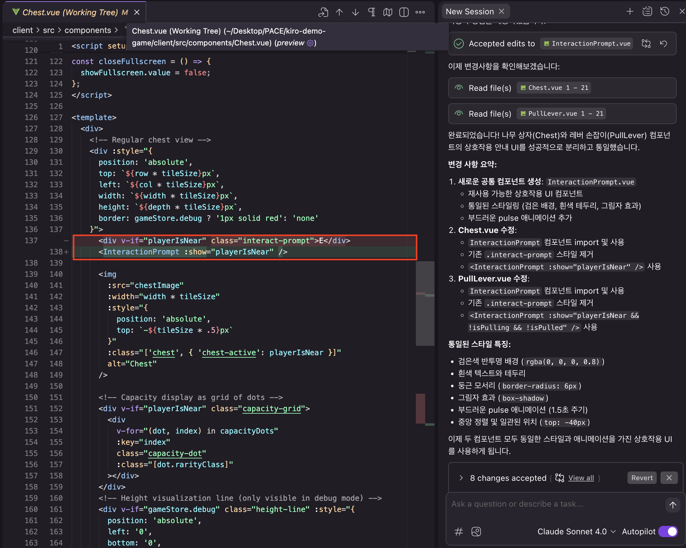

# Vibe 리팩토링

이 모듈은 이전 지침에 따라 게임을 로컬에서 실행한 상태라고 가정합니다.

---

## 1. 문제 이해하기

> "Vibe refactoring is 50% of vibe coding"

AI는 예시 기반 맥락을 이용해 새로운 솔루션을 구현하는 데 매우 능숙합니다. 하지만 이 과정에서 자연스럽게 중복된 코드가 많이 생성되는 경우도 있습니다.

이전 모듈에서는 상호작용 UI를 다뤘는데, 이제 이 부분을 더욱 면밀히 살펴볼 때입니다.



아래와 같은 프롬프트를 Kiro에 입력해 보세요:

```
E 버튼을 누르는 상호작용 안내 UI가 어떤 컴포넌트들에 구현이 되어있어?
```

Kiro는 다음과 같이 여러 컴포넌트에서 상호작용 안내 UI가 중복 구현되어 있음을 알려줄 것입니다.
- `Computer.vue`
- `Workbench.vue`
- `Chest.vue`
- `Garbage.vue`
- `GameItem.vue`
- `PullLever.vue`
- `Dispenser.vue`

이들 파일을 열어보면, 거의 유사한 CSS와 구조로 구성된 프롬프트가 각 컴포넌트에 반복적으로 구현되어 있음을 확인할 수 있습니다.

하지만 플레이어 유령을 실제 게임 내에서 움직여보면, 프롬프트의 크기나 위치가 컴포넌트마다 약간씩 다르다는 것도 발견할 수 있습니다.

**예시**: `PullLever`의 E 버튼 크기 ≠ 나무 상자의 E 버튼 크기

## 2. 리팩토링 수행하기



이제 본격적으로 Kiro에게 리팩토링을 요청해보겠습니다.

```
나무 상자와 레버 손잡이 컴포넌트만 상호작용 안내 UI를 별도의 공통 컴포넌트로 분리하고, 스타일을 통일해줘.
```

## 3. 결과 검토하기

Kiro는 나무 상자와 레버 손잡이 컴포넌트에 구현된 상호작용 안내 UI를 찾아내어, 이를 공통의 새 컴포넌트로 교체할 것입니다.



아래와 같은 점들을 직접 검토하세요:
- 기존 구현에서 프롬프트 위치는 컴포넌트마다 위/왼쪽/오른쪽 등 다양했는데, 이 차이가 리팩토링 과정에서 사라지진 않았는가?
- 화면 크기에 따라 텍스트 크기를 유지하기 위해 두 가지 다른 접근 방식이 쓰이고 있었는데, AI는 어떤 방식을 택했는가?


> [!WARNING]
> **주의**
>
> AI의 리팩토링 결과는 훌륭할 수 있지만, 기능이 손상되지 않았는지 반드시 확인해야 합니다.


## 4. 추가 리팩토링 기회 찾기

다음과 같은 질문도 Kiro에게 해보세요:

```
내 컴포넌트들을 살펴봐줘. 리팩토링이 필요한 부분이나 베스트 프랙티스 관점에서 개선할 수 있는 게 있을까?
```


> [!NOTE]
> **활용 팁**
>
> AI 모델은 일반적으로 친절하고 순응적인 훈련을 받았기 때문에, 스스로 비판하거나 질문자의 요청을 반박하는 경우는 드뭅니다. 하지만 명시적으로 리뷰나 비판을 요청하면, AI는 충분히 날카로운 인사이트를 제공할 수 있습니다.


## 핵심 개념

이 모듈에서 배운 두 가지 핵심 개념:

1. **바이브 코딩도 리팩토링이 필요하다.** 즉흥적인 생성도 중요하지만, 일정 주기로 의도적이고 체계적인 정리(vibe refactor)가 반드시 필요합니다.

2. **AI는 틀렸다고 말하진 않지만, 틀린 걸 알아차릴 능력은 있습니다.** 스스로 피드백을 주진 않지만, "검토해달라"는 요청을 통해 훌륭한 리뷰어가 될 수 있습니다.
