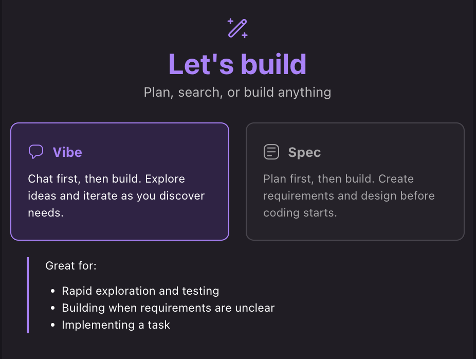

# 바이브 세션

## 바이브 세션이란?
바이브 세션은 Kiro의 대화형 Q&A 중심으로 개발하는 모드입니다. 신속하게 질문하고 설명을 주고받는 대화 방식으로 프로젝트를 구축합니다.

## 접근 방법
새 세션을 시작할 때 바이브 세션과 스펙 세션 간에 전환이 가능합니다. 이를 통해 현재 작업에 가장 적합한 상호작용 스타일을 선택할 수 있습니다.

## 바이브 세션을 사용하는 경우
- 대화형 Q&A 형식: 바이브 세션은 코드에 대한 양방향 대화에 최적화되어 있어, 질문을 하고 즉각적인 응답을 받을 수 있습니다.

- 빠른 지원: 코딩 질문에 대한 빠른 답변, 코드 동작 설명, 또는 공식적인 명세 과정 없이 개념을 이해하는 데 이상적입니다.

- 맥락 이해: 다른 Kiro 세션과 마찬가지로 바이브 세션은 컨텍스트 제공자를 활용하여 코드베이스를 이해하지만, 광범위한 코드 생성보다는 설명에 중점을 둡니다.

- 유연성: 바이브 세션은 스펙 세션에 비해 더 유동적이고 덜 구조화된 방식입니다. 탐색적인 코딩과 학습에 적합합니다.

## 다음 단계

게임과 함께 학습하기 위해 **다음 단계로 이동**해보세요.
- [미묘한 물리 버그 수정](01-physics-bug-fix/README.md)
- [여러 파일의 상호작용 버그 수정](02-interactions-bug-fix/README.md)
- [Vibe 리팩토링](03-vibe-refactoring/README.md)
