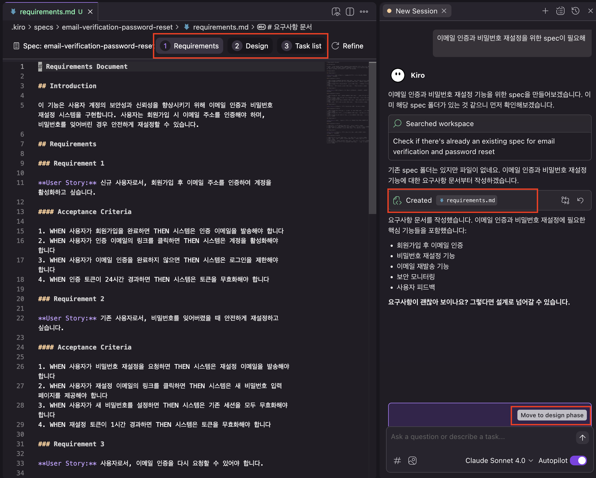
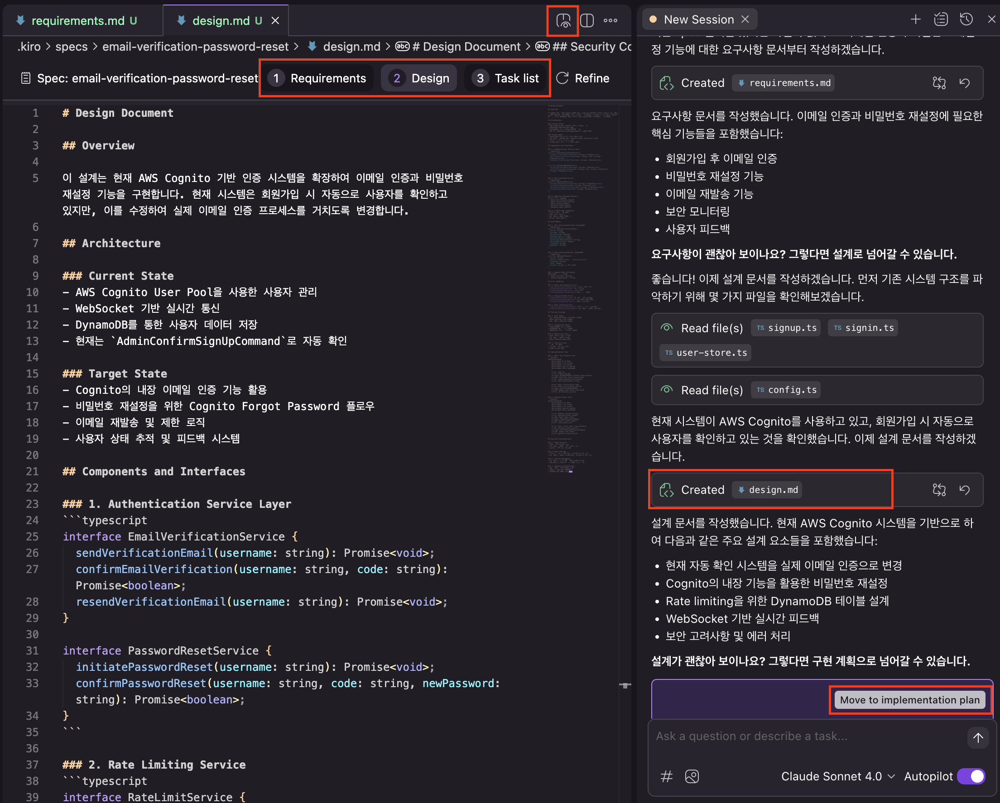
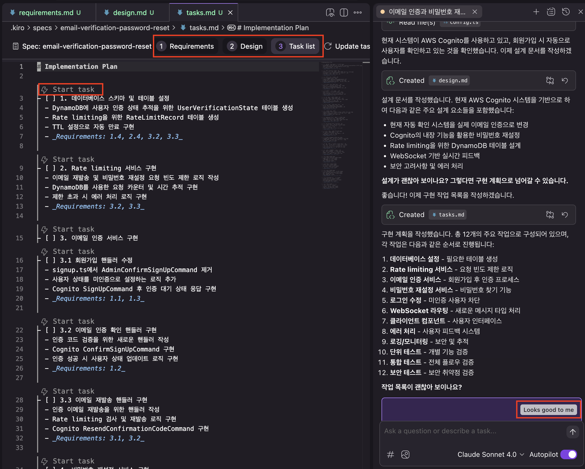

# 복잡한 작업을 위한 Spec 기능 사용

이 모듈은 이전 지침에 따라 게임을 로컬에서 실행한 상태라고 가정합니다.

---

앞선 모듈들에서 우리는 다음과 같은 작업을 수행했습니다.

- HTML 및 CSS를 작성하여 홈페이지 개선
- 게임 물리 엔진의 핵심 버그 수정
- 상호작용 로직 리팩토링으로 버그 해결
- 여러 컴포넌트에 걸친 DRY 리팩토링 수행

지금까지는 비교적 작은 수정이나 리팩토링 작업이었지만, **이제는 복잡한 신규 기능 개발**을 해볼 차례입니다. Kiro는 이런 상황에서도 도움이 됩니다.

---

## 1. 문제 이해하기

게임의 로그인 페이지를 보면, **"비밀번호를 잊으셨나요?" 링크가 없음**을 확인할 수 있습니다.

현재 이 게임은 Amazon Cognito를 이용한 인증을 사용하고 있지만, 구현은 아직 매우 기본적인 수준입니다.

**비밀번호 재설정 이메일**을 보내기 위해서는 Cognito에서 **이메일 인증**이 선행되어야 합니다.

따라서 아래 두 가지 작업 트리를 순차적으로 처리해야 합니다.

- **이메일 인증 구현**
    - 프론트엔드: 클라이언트 측 컴포넌트
    - 백엔드: 서버 라우트 및 Cognito 통합
- **비밀번호 재설정 구현**
    - 프론트엔드: 클라이언트 측 화면
    - 백엔드: 서버 라우트 및 Cognito 통합

---

## 2. 명세서 요청하기

Kiro에 다음과 같은 프롬프트를 입력해보세요:

```markdown
사용자가 현재 비밀번호로 인증하여 비밀번호를 변경할 수 있는 옵션을 제공하고 싶습니다. 해당 설계를 위한 명세가 필요해요.
```

Kiro는 프로젝트 정보를 수집하고, 이 복잡한 작업을 위한 명세서를 설계하기 시작할 것입니다.

---

## 3. 요구사항 검토하기

Kiro는 위 요청을 바탕으로 **사용자 스토리 기반의 상세 요구사항** 목록을 생성합니다.

이 스토리와 요구사항은 처음엔 모호했던 요청을 구체화해주고, **미처 생각하지 못했던 엣지 케이스들**까지 드러내 줍니다.



요구사항을 읽어본 뒤:

- 필요 시: 상세 피드백 제공
- 만족 시: **"Move to design phase"** 클릭하여 다음 단계로 진행

---

## 4. 설계안 검토하기

이제 Kiro는 기존 코드베이스와 요구사항을 비교하여, 이를 구현하기 위한 설계를 상상하고 제안합니다.




> [!NOTE]
> **활용 팁**
>
> 오른쪽 상단 `Preview` 버튼을 클릭하면, **렌더링된 설계 문서와 플로우 다이어그램**을 볼 수 있습니다.


디자인 문서에는 문제 해결을 위해 Kiro가 작성하려는 코드와 유사한 **예제 코드 스니펫**이 포함되어 있을 수 있습니다.

하지만 이 코드의 세부 구현에 **너무 집착할 필요는 없습니다**.

이 코드는 API 구조를 상상한 의사코드(pseudocode)일 뿐이며, 실제 구현은 약간 다르게 작성될 수 있습니다.

디자인 문서를 모두 읽은 후에는 다음 중 하나를 선택하세요:

- 수정 또는 개선이 필요하다고 판단되면, **구체적인 피드백을 프롬프트에 입력**
- 그대로 진행해도 괜찮다면 **"Move to Implementation plan"** 클릭하여 다음 단계로 이동

---

## 5. 작업 목록 검토 및 수행하기

Kiro는 요구사항 및 설계 문서를 바탕으로 실행할 작업 목록(Task List)을 작성합니다.



이 목록은 새 기능 개발의 **단계별 이정표**라고 보면 됩니다.

작업 목록을 수정하고 싶다면 프롬프트에 피드백을 입력하거나, 수정 없이 계속 진행하려면 "Looks good to me" 버튼을 클릭하면 됩니다.

### 작업 목록 순서 커스터마이징

작업 목록은 여러분이 vibe coding 시 선호하는 작업 순서와 일치하지 않을 수 있습니다. 예를 들어, 작업 목록에서는 테스트 개발이 마지막에 위치해 있는 경우가 많지만, 여러분은 테스트 주도 개발(TDD)을 선호할 수도 있습니다.

Kiro의 동작 방식을 수정하려면 **Steering 파일**을 사용할 수 있습니다. 예를 들어, `.kiro/steering/specs.md` 파일을 생성하고 "항상 코드를 작성하기 전에 테스트를 먼저 작성하라"는 지침을 넣으면 됩니다.


> [!NOTE]
> **활용 팁**
>
> 만약 Steering 파일이 반영이 되지 않는다면 대화 세션을 재시작하거나 steering file을 언급합니다.


### 작업 실행

작업을 시작하려면 해당 작업 위의 "Start Task" 버튼을 클릭하세요. Kiro는 즉시 해당 작업을 수행합니다.

여러 Task의 Start Task를 눌러서 작업 Queue에 넣을 수 있습니다.


> [!WARNING]
> **주의**
>
> 작업이 "완료됨(Task Completed)"으로 표시되더라도, **생성된 코드는 직접 리뷰하고 테스트하고 반복해야 합니다.**

---

## 6. 명세서의 저장 위치 및 활용

모든 명세서는 `.kiro/specs` 디렉토리에 저장됩니다.

이 파일들은 **의도적 설계 문서**이므로, 반드시 코드와 함께 커밋하는 것이 권장됩니다.

이러한 명세서는 시간이 지나면서 점점 쌓이게 되며:

- 후속 개발자에게 코드의 설계 배경을 설명하는 **가이드 역할**
- Kiro가 동일 기능을 다시 다룰 때 **맥락 정보 제공** 역할을 하게 됩니다.

---

## 핵심 개념

이 모듈에서 배운 핵심 개념 2가지:

1. **바이브 코딩만으론 충분하지 않다.** 복잡한 기능을 만들 땐 Kiro 명세서를 활용해 **요구사항 정의 → 설계 → 작업 계획**을 체계적으로 수립해야 한다.

2. **Steering 파일은 맥락 제공용 그 이상이다.** 이 파일들을 통해 **Kiro의 행동 방식을 커스터마이징**할 수 있다. 예: TDD 우선, 스타일 가이드 강제 등
