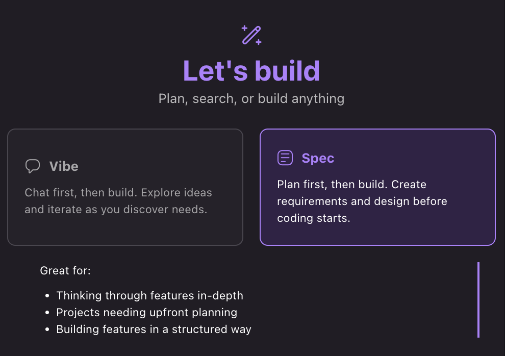

# 스펙 세션

## 스펙 세션이란?
Kiro 의 스펙 세션은 복잡한 작업을 구조화된 소프트웨어 개발 프로세스를 통해 실체화 하는 방식입니다. 추상적이며 고수준의 아이디어에서 체계적인 실행 및 명확한 추적이 가능한 구현 계획을 만들어 낼 수 있습니다.

## 접근 방법
새 세션을 시작할 때 스펙 세션과 바이브 세션 간에 전환할 수 있습니다. 복잡한 개발 작업이 있을 때 스펙 세션을 선택하면 철저한 구현에 필요한 구조를 제공받을 수 있습니다.

## 스펙 세션을 사용하는 경우
- 복잡한 개발 작업: 신중한 계획과 실행이 필요한 복잡한 기능 구축, 전체 애플리케이션 개발, 또는 대규모 리팩토링에 스펙 세션을 사용합니다.

- 구조화된 접근: 요구사항과 구현 세부사항에 대한 명확한 문서화와 함께 체계적인 단계별 개발 접근 방식이 필요할 때 사용합니다.

- 팀 협업: 여러 팀 구성원이 구현 계획을 이해해야하고 명세서에 따른 진행 상황을 추적해야 하는 프로젝트에 적합합니다.

- 문서화: 향후 참조나 지식 공유를 위해 코드 구현과 함께 상세한 문서를 생성하고자 할 때 사용합니다.

## 다음 단계

게임과 함께 학습하기 위해 **다음 단계로 이동**해보세요.
- [복잡한 작업을 위한 Spec 기능 사용](01-spec-driven-development/README.md)
