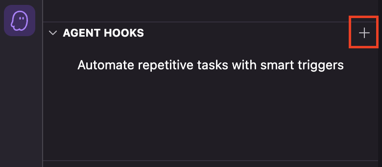
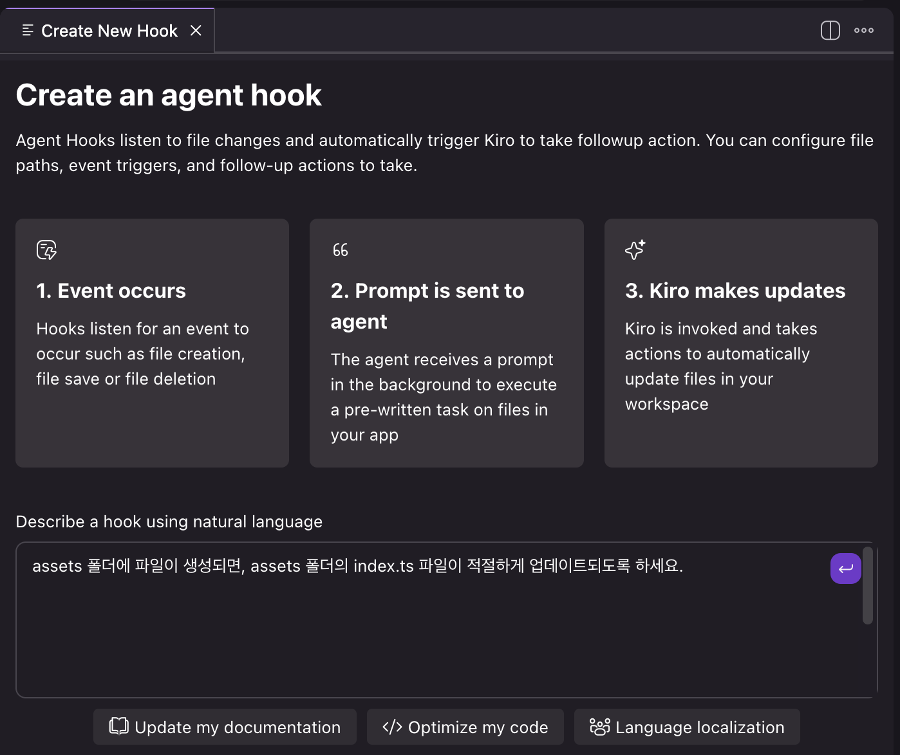
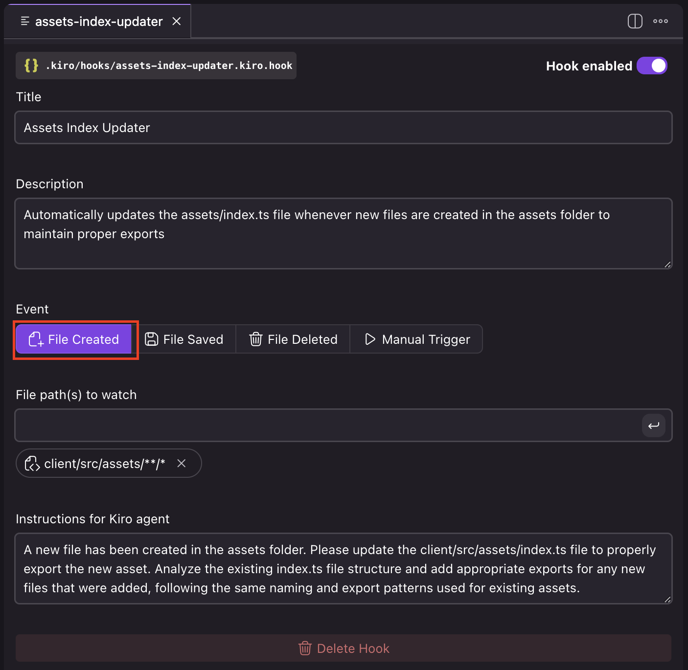
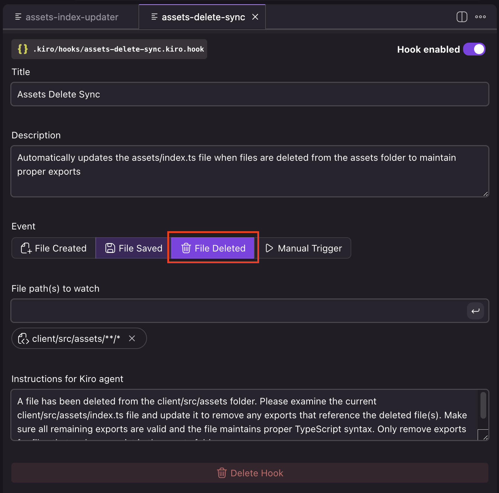

# Agent Hook으로 게임 에셋 관리

이 모듈은 여러분이 이미 게임을 로컬에서 실행하고 있다는 전제하에 진행됩니다. (설정 방법은 이전 모듈의 안내를 따르세요.)

---

이전 모듈에서 우리는 다음과 같은 작업을 완료했습니다.

- 홈페이지를 개선하기 위한 HTML 및 CSS 작성
- 게임 물리 엔진의 핵심 버그 수정
- 로직 리팩토링을 통한 상호작용 버그 수정
- 여러 컴포넌트에 걸친 DRY 리팩토링
- 명세서(Specification)을 기반으로 한 복잡한 기능 구현

이제 우리는 Kiro를 사용하여 이 게임을 코딩하면서 **반복적으로 발생하는 boilerplate 작업을 자동화**할 수 있는 Hook(hook)을 설정해 보겠습니다.

---

## 1. 문제 이해하기

`client/src/systems/preloader-system.ts` 파일을 열어보세요. 이 파일은 게임 시작 전에 모든 에셋을 미리 로드하는 시스템입니다.

**주요 기능:**
- 인증 화면에서 에셋 프리로딩 시작
- 서버 이벤트를 통한 새로운 에셋 로드 감지
- 컴포넌트와 분리된 깔끔한 설계

**현재 시스템의 한계**

프리로더는 `/client/src/assets/index.ts`의 정적 에셋 목록에 의존합니다. 

> **문제점**: 개발자가 새 컴포넌트와 에셋을 추가했지만, 정적 목록 업데이트를 깜빡할 수 있습니다.

**해결책: 자동화된 Agent Hook**

이 문제를 방지하고 개발 효율성을 높이기 위해 자동화된 Hook을 추가해보겠습니다.

---

## 2. 에셋 인덱서 Hook 만들기


1. IDE 사이드바에서 **Kiro 아이콘(👻)**을 클릭하여 Kiro 패널을 엽니다.

2. **"Agent Hooks"** 섹션을 찾아 **+ 아이콘**을 클릭해 새로운 Hook 작성을 시작하세요.



3. Hook에 대한 설명은 자연어로 입력해도 됩니다. 예를 들어 다음과 같이 입력할 수 있습니다.

```
assets 폴더에 파일이 생성되면,
assets 폴더의 index.ts 파일이 적절하게 업데이트되도록 하세요.
```





생성된 Agent Hook을 Kiro 아이콘 > Agent Hooks에서 클릭해서 Event를 **File Created**로 바꿔주세요.

Kiro는 위의 자연어 요청을 기반으로 해당 동작을 수행하는 agent hook 구성을 생성해줍니다.

이 Hook은 `.kiro/hooks` 폴더에 저장됩니다.

다음과 같은 구조로 생성될 것입니다.

```json
{
  "enabled": true,
  "name": "Assets Index Updater",
  "description": "Automatically updates the assets/index.ts file whenever new files are created in the assets folder to maintain proper exports",
  "version": "1",
  "when": {
    "type": "fileCreated",
    "patterns": [
      "client/src/assets/**/*"
    ]
  },
  "then": {
    "type": "askAgent",
    "prompt": "A new file has been created in the assets folder. Please update the client/src/assets/index.ts file to properly export the new asset. Make sure to follow the existing pattern in the index.ts file and add appropriate import/export statements for the new file. Consider the file type (image, CSS, etc.) and export it with an appropriate name that follows the project's naming conventions."
  }
}
```

---

## 3. assets 제거 Hook 만들기

마찬가지로 이번엔 다음 프롬프트로 새로운 Hook을 생성해보겠습니다.

```
assets 폴더에 파일이 삭제되면, assets 폴더의 index.ts 파일에서 해당 파일 레퍼런스를 삭제해주세요.
```



생성된 Agent Hook을 Kiro 아이콘 > Agent Hooks에서 클릭해서 Event를 **File Deleted**로 바꿔주세요.

Kiro가 생성하는 Hook 구성은 다음과 같습니다.

```json
{
  "enabled": true,
  "name": "Assets Delete Sync",
  "description": "Automatically updates the assets/index.ts file when files are deleted from the assets folder to maintain proper exports",
  "version": "1",
  "when": {
    "type": "fileDeleted",
    "patterns": [
      "client/src/assets/**/*"
    ]
  },
  "then": {
    "type": "askAgent",
    "prompt": "A file has been deleted from the client/src/assets folder. Please examine the current client/src/assets/index.ts file and update it to remove any exports that reference the deleted file(s). Make sure all remaining exports are valid and the file maintains proper TypeScript syntax. Only remove exports for files that no longer exist in the assets folder."
  }
}
```

이제 두 개의 Hook이 `.kiro/hooks`에 설정되었고, Kiro 패널의 **"Agent Hooks"** 아래에도 표시되어야 합니다.

---

## 4. Hook 테스트하기

1. `client/src/assets` 폴더에 이미지 파일을 드래그 앤 드롭해보세요.
   
   에셋 인덱서 Hook이 작동하는 모습을 확인할 수 있습니다.

2. 그다음 해당 이미지를 삭제하면, 에셋 제거 Hook이 작동하여 `index.ts`에서 관련 내용을 제거해줍니다.


> [!NOTE]
> **활용 팁**
>
> Hook의 에이전트 메시지를 보려면, 채팅 패널 상단의 **Task list** 버튼을 클릭한 후 활성화된 **Current Task**를 선택하세요. 또는 **History** 버튼을 눌러 이미 완료된 Hook의 메시지를 확인할 수도 있습니다.


---


## 핵심 개념

이 모듈에서는 다음과 같은 내용을 배웠습니다.

1. **프로젝트의 반복 작업을 자동화하기 위한 Agent Hook 생성 및 구성 방법**
2. **boilerplate 작업의 정확도와 생산성을 높이는 방법**
