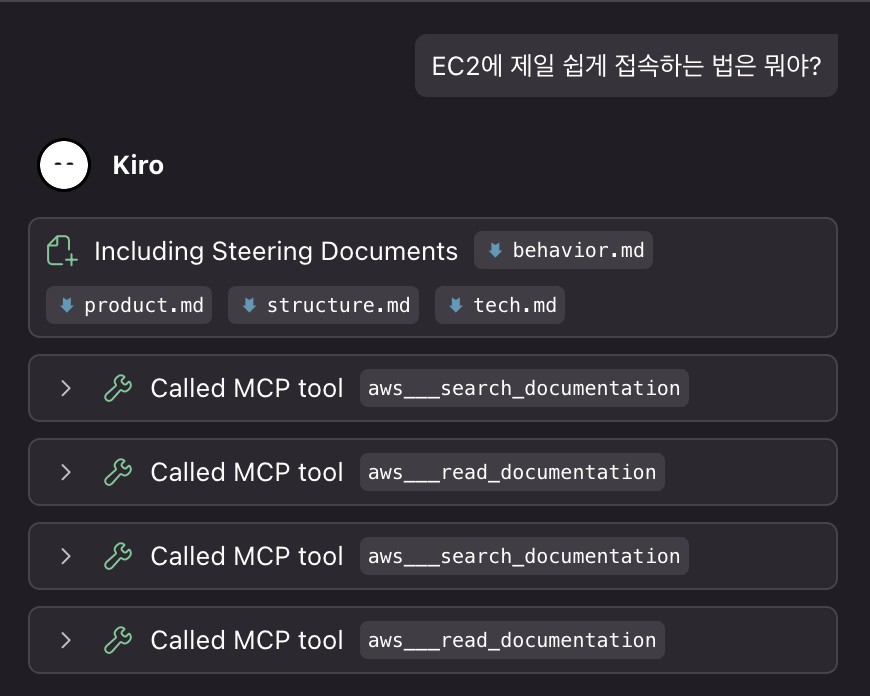
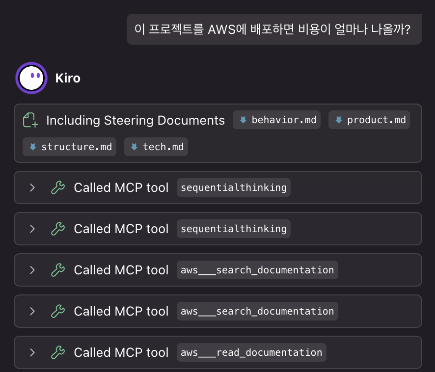

# MCP로 Kiro 확장하기

이 모듈은 여러분이 게임을 로컬에서 실행하도록 설정을 마친 상태라고 가정합니다.

---

이전 모듈에서 우리는 다음을 완료했습니다.

- 홈페이지를 개선하기 위한 HTML 및 CSS 작성
- 게임 물리 엔진의 핵심 버그 수정
- 로직 리팩토링을 통한 상호작용 버그 수정
- 여러 컴포넌트에 걸친 DRY 리팩토링
- 명세서(Specification)을 기반으로 한 복잡한 기능 구현
- Agent Hook을 활용한 에셋 관리 자동화 구성

이제 Kiro의 동작을 보다 고급 용도에 맞게 조정하기 위해 **Kiro 자체를 사용자 정의**해볼 차례입니다. 이를 위해 **Model Context Protocol (MCP)**을 통해 Kiro에 새로운 기능을 추가하겠습니다.

---

## 1. MCP 서버 설정

Kiro는 기본적으로 MCP를 지원합니다. IDE의 Kiro **유령 모양 아이콘 탭**을 클릭하고, 목록에서 **"MCP Servers"** 항목을 찾은 뒤, **수정 아이콘**을 눌러 MCP 서버를 추가합니다.

이 예제에서는 두 가지 MCP 서버를 추가하겠습니다.

- **AWS Knowledge MCP Server**: AWS 문서, API 참조, 아키텍처 가이드 등 최신 AWS 지식에 실시간으로 접근할 수 있는 원격 서버입니다. AWS 인증 없이 사용 가능하며, Kiro가 AWS 관련 질문에 더 정확하고 최신 정보로 답변할 수 있도록 도와줍니다.

- **Sequential Thinking**: Kiro가 복잡한 작업을 수행하기 전에 단계별로 사고하고 계획을 수립하도록 도와주는 서버입니다. 문제를 체계적으로 분석하고 순차적인 해결 방안을 제시합니다.

열리는 `mcp.json` 파일의 내용을 다음과 같이 수정합니다.

```json
{
    "mcpServers": {
        "aws-knowledge-mcp-server": {
            "command": "npx",
            "args": [
                "mcp-remote",
                "https://knowledge-mcp.global.api.aws"
            ]
        },
        "sequential-thinking": {
            "command": "npx",
            "args": ["-y", "@modelcontextprotocol/server-sequential-thinking"]
        }
    }
}
```


> [!NOTE]
> **MCP 연결시 AbortError**
>
> MCP 서버 연결 시 `AbortError`가 발생하는 경우, npm 캐시를 정리해보세요.
> ```bash
> npm cache clean --force
> ```


---

## 2. AWS Knowledge MCP Server 활용해보기

이제 새로운 MCP 서버 도구를 활용하도록 Kiro의 행동을 조정할 수 있습니다.

`.kiro/steering/behavior.md` 파일을 생성하고, 다음 내용을 추가합니다.

```markdown
AWS와 관련된 질문은 aws-knowledge-mcp-server를 활용해서 정확한 답변을 할 수 있도록 하세요.
```

이제 Kiro에게 다음과 같이 요청해보세요

```
EC2에 제일 쉽게 접속하는 방법은 뭐야?
```



---

## 3. 사고 방식 조정하기

`.kiro/steering/behavior.md` 파일을 다시 열고 다음 내용을 **뒤에 추가**해주세요.

```markdown
무언가를 수행하는 방법을 계획할 때, sequentialthinking 도구를 사용하여 다음 여러 단계를 순차적으로 계획하세요.
```

그런 다음 채팅창에 다음과 같이 요청해보세요

```
이 프로젝트를 AWS에 배포하면 비용이 얼마나 나올까?
```



Kiro가 sequential-thinking과 knowledge-mcp-server를 사용하는 것을 볼 수 있습니다.

---

## 4. 더 많은 MCP 서버 찾기

- [Awesome MCP Servers](https://github.com/wong2/awesome-mcp-servers)
- [AWS MCP Servers](https://github.com/awslabs/mcp)

---

## 핵심 개념

이 모듈에서는 다음과 같은 핵심 개념을 배웠습니다.

1. **Kiro를 확장하기 위해 MCP 서버를 도입**하여, 프로젝트 내에서 사용할 수 있는 새로운 컨텍스트 소스, 도구, 행동 패턴을 추가할 수 있습니다.

2. **수많은 MCP 서버가 존재**하며, 이를 창의적으로 조합하여 Kiro의 능력을 프로젝트에 최적화할 수 있습니다.

이제 Kiro를 진짜 여러분의 도구로 만들어보세요!
