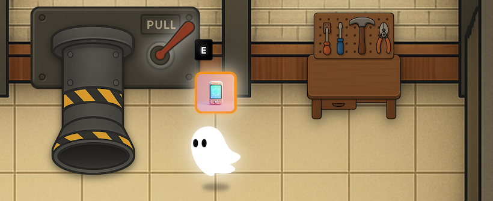
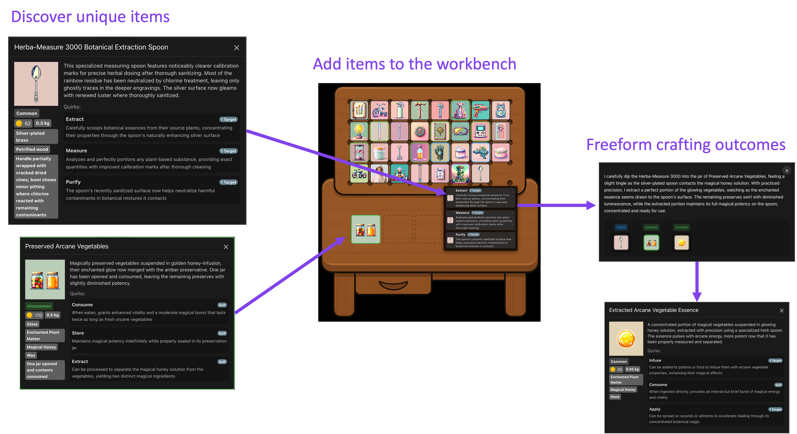

# 플레이 하며 배우는 Kiro IDE

**Spirit of Kiro**의 코드 중 약 95%는 Kiro를 통해 프롬프트로 작성되었습니다. 여러분은 이 게임을 완성하기 위해 **버그를 수정하고 기능을 추가**하면서 Kiro를 사용할 것입니다.

---

## Sprit of Kiro 

**Spirit of Kiro**는 무한 제작(Infinite Crafting) 게임입니다.

게임 스크린샷을 보세요. 만화 스타일의 유령이 **PULL** 이라 적힌 대형 산업용 레버와 작업대 앞에 서 있습니다. 유령 앞에는 빛나는 카드와 함께 **E** 키를 나타내는 지시자가 보입니다.

게임에서 어떤 플레이가 가능할까요?

- 무작위로 생성되는 고유 아이템 발견하기
- 아이템들끼리 “자르기(cut)”, “칠하기(paint)”, “붙이기(glue)”, “마법 부여(enchant)” 상호작용
- 결과물 아이템을 **AI 감정사에게 판매** 하기

게임 속 모든 오브젝트는 AI로 생성됩니다. 오브젝트 간의 상호작용 역시 AI로 시뮬레이션됩니다. 이로 인해 **무한한 리플레이 및 가능성**을 지니는 게임입니다!

**게임 내 핵심 제작 메커니즘**

게임 메커니즘을 나타내는 스크린샷을 보세요.

플레이어는 **숟가락**과 **야채가 담긴 유리병** 두 가지 아이템을 발견한 상태입니다. 숟가락을 사용해 병에서 샘플을 추출할 수 있습니다.

- 작업대 인터페이스에는 다양한 아이템이 격자 형태로 표시됩니다.
- “식물 추출용 숟가락”, “야채 병”과 같은 설명 팝업을 확인할 수 있습니다.
- 보라색 화살표 처럼, 상세 아이템 정보를 확인하고, 고유 아이템을 작업대에 추가하여 자유로운 제작 결과를 획득할 수 있습니다.

**우리의 과제**

현재 게임의 핵심 루프는 완성된 상태지만, 아직 끝나지 않았습니다.

1. 게임의 [**풍부한 로드맵**](https://github.com/kirodotdev/kiro-demo-game/blob/main/docs/ROADMAP.md)이 이미 기획되었습니다. 추가로 개발할 아이디어들이 가득합니다. 
2. 일부 버그는 **실습자가 Kiro로 직접 고쳐볼 수 있도록** 일부러 존재하고 있습니다.

이 가이드에서는 **Spirit of Kiro 오픈소스의 `challenge` 브랜치에서 일련의 작업을 수행하며 Kiro를 배우게 됩니다.**

**준비되셨나요? 시작해봅시다!**

---
## 실습 과정

### **1. 설정**

먼저, 여러분이 AWS 계정을 보유하고 있는지 확인합니다.

그 후 Cognito 사용자 풀을 설정하여 인증 기능을 구축하고, Docker Compose 파일을 통해 게임 스택을 빌드 및 실행하며, DynamoDB 테이블을 초기화합니다.

마지막으로, 게임이 로컬에서 잘 실행되는지 확인합니다.

---

### **2. 과제: 게임 홈페이지 개선**

Kiro가 프로젝트를 제대로 이해할 수 있도록 **Steering 파일을 설정**합니다.

전체적인 프로젝트 맥락을 파악한 Kiro에게 **게임의 홈 랜딩 페이지를 개선**하도록 지시합니다.

---

### **3. 버그 수정: 물리 엔진 오류**

게임 탭에서 **다른 창으로 전환한 뒤** 다시 돌아오면 물리 엔진이 이상하게 작동합니다.

이 **미묘한 버그를 Kiro가 고칠 수 있을까요?**

---

### **4. 버그 수정: 상호작용 처리 누락**

게임의 상호작용 기능은 초기에 “vibe coded“입니다.

하지만 **AI가 뭔가를 빠뜨린 것 같습니다.**

Kiro는 **스스로 만든 실수**를 고칠 수 있을까요?

---

### **5. 리팩토링: Kiro로 코드 간결화**

“vibe coding”만 있는 것이 아닙니다.

**“vibe refactoring”도 함께 합니다.**

---

### **6. 신규 기능: 복잡한 기능 구현**

현재 게임에는 **이메일 인증 및 비밀번호 재설정** 기능이 빠져 있습니다.

이제 클라이언트와 서버 양쪽에 걸친 **상당히 복잡한 기능을 Kiro와 함께 구현**합니다.

---

### **7. 자동화: Agent Hook으로 에셋 관리**

우리는 반복적이고 오류가 잦은 에셋 관리 작업을 식별했습니다.

다행히도 **Kiro의 Agent Hook**을 통해 이를 **자동화할 수 있습니다.**

---

### **8. Kiro 확장: MCP로 기능 확장**

이 게임을 여러분만의 것으로 만들 수 있을 뿐 아니라, Kiro 자체도 Model Context Protocol (MCP)를 통해 **여러분의 도구로 확장**할 수 있습니다.

---

## 학습 목표

이 워크샵이 제공하는 학습 컨텐츠입니다.
- Kiro AI 개발 도구의 핵심 기능과 사용법
- AI 기반 코드 생성 및 버그 수정 기법
- 복잡한 기능 구현을 위한 AI 활용 방법
- Agent Hook을 통한 작업 자동화
- Model Context Protocol (MCP)를 통한 Kiro 확장

## 실습 대상

- 소프트웨어 개발자 (초급~중급)
- AI 기반 개발 도구에 관심이 있는 개발자
- 게임 개발에 관심이 있는 개발자
- 코드 자동화 및 생산성 향상을 원하는 개발자

## 사전 요구사항

워크샵 참여에 필요한 일반적인 지식 및 로컬 환경이 세팅되어야 합니다. AWS Workshop Event 환경을 제공받는 경우 약간의 프로그래밍 지식만으로 이번 실습을 진행하실 수 있습니다.
- **기본 프로그래밍 지식**: JavaScript, HTML, CSS에 대한 기본 이해
- **AWS 계정**: 실습을 위한 활성 AWS 계정 필요
- **Docker(Podman)**: Docker 및 Docker Compose 와 같은 컨테이너 런타임 이해
- **Git**: 기본적인 Git 명령어 사용법
- 로컬 개발 환경 구성 능력

## 비용 안내

> [!WARNING]
> **중요**
>
> 이 워크샵을 개인 AWS 계정에서 진행하실 경우 AWS 서비스 사용으로 인한 비용이 발생할 수 있습니다.

- **Amazon Cognito**: 사용자 풀 및 인증 서비스
- **Amazon DynamoDB**: 게임 데이터 저장
- **기타 AWS 서비스**: 워크샵 진행 중 사용되는 추가 서비스

**요금 정보**
- [AWS Cognito 요금](https://aws.amazon.com/cognito/pricing/)
- [Amazon DynamoDB 요금](https://aws.amazon.com/dynamodb/pricing/)
- [AWS 요금 계산기](https://calculator.aws)에서 예상 비용 확인

대부분의 실습은 AWS 프리 티어 범위 내에서 진행 가능하지만, 사용량에 따라 소액의 비용이 발생할 수 있습니다.

이제 여러분의 학습 여정을 시작하기 위해, **다음 단계로 이동**해보세요.
- [준비사항](01-setup-dev-env-launch-game/README.md)
- [스티어링](02-steering/README.md)
- [바이브 세션](03-vibe-mode/README.md)
- [스펙 세션](04-spec-mode/README.md)
- [고급 기능](05-advanced/README.md)
- [결론](06-conclusion/README.md)
- [실습 환경 정리](07-cleanup/README.md)
